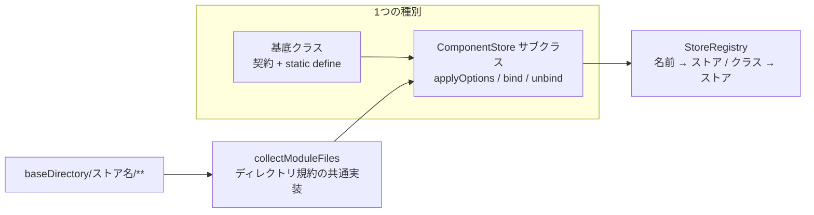
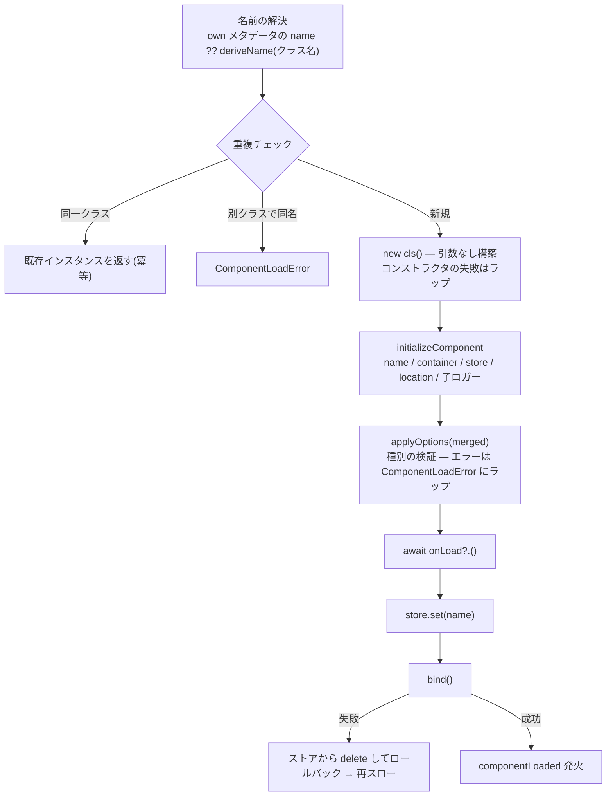

# コンポーネントシステム

「ロードされるあらゆる単位は Component、1種別 = 基底クラス + ストア」という
中心設計の内部を解説します。実装は
[`src/component/`](../../src/component/) の3ファイル + 探索の
[`src/discovery.ts`](../../src/discovery.ts) です。



## Component([`Component.ts`](../../src/component/Component.ts))

基底クラスが持つのは、フレームワークが初期化するフィールドと2つの
フックだけです:

| メンバー | 内容 |
| --- | --- |
| `name` | ストア内で一意。導出規則は後述 |
| `container` / `client` / `services` | コンテナと、その短縮ゲッター |
| `store` | 所属ストア |
| `logger` | `{ store, component }` が束縛済みの pino 子ロガー |
| `location` | 自動探索元の絶対パス(明示登録なら `null`) |
| `onLoad?()` / `onUnload?()` | ライフサイクルフック(どちらも `await` される) |

フィールドはすべて `declare readonly` で宣言され、実体は
`initializeComponent()`(**内部 API** — `index.ts` から export されて
いません)が構築直後に `Object.assign` で割り当てます。これにより
コンポーネントは **引数なしで構築** でき、他フレームワークにある
`constructor(context, options) { super(context, options) }` の引き回しが
不要になっています。

## ComponentStore([`ComponentStore.ts`](../../src/component/ComponentStore.ts))

ストアは discord.js の `Collection<string, T>` を継承した、1種別の
コンポーネント置き場 + ローダーです。コンストラクタは
`ComponentStoreOptions` を受け取ります:

| オプション | 既定 | 意味 |
| --- | --- | --- |
| `name` | — | ストア名。**そのまま自動探索ディレクトリ名**(`<baseDirectory>/<name>/**`)。慣例として複数形 |
| `base` | — | この種別のコンポーネントが継承すべき基底クラス |
| `suffix` | ストア名の単数形(`singularize`: 末尾の `s` を1文字落とすだけ) | 名前導出でクラス名から取り除く接尾辞 |

### ロードパイプライン(`load`)



要点:

- 名前は「自身の(own の)メタデータの `name`」→ 無ければ
  `deriveName(cls.name)`。**継承したメタデータの `name` は使いません**
  ([デコレータとメタデータ](./decorator-metadata.md))。
- 同じクラスの二重ロードは既存インスタンスを返すだけの冪等操作。
  **別クラス** が同名に解決された場合だけ `ComponentLoadError` です。
- `applyOptions` の例外は(すでに `ComponentLoadError` でなければ)
  `ComponentLoadError` にラップされます。`onLoad` の例外もコンポーネント名と
  ロード元パスを持つ `ComponentLoadError` にラップされます。
- `bind` の失敗はストアから delete し、`unbind` と `onUnload` で
  `onLoad` 後の副作用を巻き戻してから再スローします。

### `register` と `loadAll` のキュー

`register()` は `loadAll` の前ならキュー(`#pending`)へ積み、後なら
即座に `load`(fire-and-forget、失敗はログ)します。`loadAll` は:

1. `#pending` を **空になるまで** 排出(`#drainPending`)。
   1回の `splice` にしないのは、コンポーネントの `onLoad()` が同じストアへ
   `register()` することがあり(その時点では `#loadedAll` がまだ false
   なのでキューに積まれる)、1回だと黙って消えるためです。
2. `baseDirectory` があれば `<baseDirectory>/<name>` を自動探索
   (`#loadDirectory`)。
3. 自動探索されたコンポーネントの `onLoad()` が積んだ分も再度排出。

### 自動探索(`#loadDirectory` と `collectModuleFiles`)

対象ファイルの収集は [`src/discovery.ts`](../../src/discovery.ts) の
`collectModuleFiles(directory)` に委ねられます。規則は4つだけです:

- `**/*.{ts,tsx,js,jsx}` を **再帰的に** 走査(`Bun.Glob`)
- パスの途中を含め、**`_` で始まるファイル・ディレクトリはスキップ**
  (共有コードは `_shared.ts` や `_internal/` へ)
- `*.d.ts` とテスト(`*.test.*` / `*.spec.*` の ts/js/tsx/jsx)はスキップ
- 結果は **パスの昇順にソート**(ロード順を決定的にするため)。
  ディレクトリが無ければ空配列

`#loadDirectory` は返ってきたパスを `import` し、
`value.prototype instanceof store.base` な export だけをロードします
(基底クラス自身は除外)。名前の導出はクラス名だけが入力なので、
**ディレクトリの深さや名前はコンポーネント名に影響しません**
(`commands/music/PlayCommand.ts` → `play`)。

同じ関数が[設定ディレクトリ](./config-loading.md)の読み込みでも使われ、
Public API としても export されています。「規約ディレクトリはどのファイルを
読むのか」という問いの答えは、リポジトリ全体で1か所だけです。

### 名前の導出(`deriveName` と `suffix`)

既定の `deriveName` は「`suffix` を末尾一致(大文字小文字無視)で
取り除き、ケバブケース化」です(`UserInfoCommand` → `user-info`)。
接尾辞を取り除くとクラス名が丸ごと消える場合は取り除きません。

`suffix` を明示するのは **ディレクトリ名とクラス名の語が揃わない種別だけ**
です。公式 ai プラグインが実例です
([`plugins/ai/src/AiTool.ts`](../../plugins/ai/src/AiTool.ts)):

```ts
// ディレクトリ名は `ai/`(`tools/` だと「誰のツールか」が判らないため)。
// クラス名の接尾辞だけは `Tool` のまま — `NowPlayingTool` → `now-playing`。
super({ name: "ai", base: AiTool, suffix: "Tool" });
```

規則そのものを変えたい種別は `deriveName` をオーバーライドします。
コアに2つ実例があります:

- [`ServiceStore`](../../src/service/ServiceStore.ts) — プロパティとして
  自然に参照できるよう **lowerCamelCase**
  (`GuildSettingsService` → `guildSettings`)。
- [`PreconditionStore`](../../src/precondition/PreconditionStore.ts) —
  `Preconditions` インターフェースのキーと一致させるため
  **大文字小文字を保持**(`OwnerOnlyPrecondition` → `OwnerOnly`)。

### ストア側のオーバーライドポイント

| オーバーライド | 責務 | 呼ばれるタイミング |
| --- | --- | --- |
| `applyOptions(component, options)` | メタデータの検証と型付きフィールドの割り当て | 初期化直後(`onLoad` より前) |
| `bind(component)` | ランタイムへの配線(購読・タイマー・インデックス) | ストア追加後 |
| `unbind(component)` | `bind` の巻き戻し | アンロード時(delete 後・`onUnload` 前) |
| `deriveName(className)` | 命名規則の変更 | 名前解決時 |

## StoreRegistry([`StoreRegistry.ts`](../../src/component/StoreRegistry.ts))

クライアントが持つ全ストアの集合です。

- `register(store)` — 名前の重複は `FrameworkError`。登録時に
  `container` と `{ store: name }` 付き子ロガーを `Object.assign` で
  割り当てます。コアストア(`services` → `commands` → `listeners` →
  `preconditions`)はクライアントのコンストラクタが登録し、追加のストアは
  プラグインが `install` で登録します。**この登録順がそのままロード順**
  です。
- `get(name)` — `Stores` インターフェース(宣言マージの対象)で型付け
  されたルックアップ。
- `resolve(cls)` — コンポーネントクラスの担当ストアをプロトタイプ
  チェーンから解決します。複数のストアがマッチする場合(基底クラスが
  入れ子のとき)は、**より具体的な基底を持つストアが優先** されます。
  どのストアにもマッチしなければ `FrameworkError` です。
  `client.register(...)` はこの解決に乗っているため、利用者はストアを
  指定せずクラスを渡すだけで済みます。
- `loadAll` は登録順に逐次、`unloadAll` は **登録の逆順** です。

## `Stores` 宣言マージ

`stores.get("...")` の型は `Stores` インターフェースが担います。種別を
追加するプラグインはこれを宣言マージします(実例:
[`plugins/utils/src/index.ts`](../../plugins/utils/src/index.ts)):

```ts
declare module "@cc-discord-framework/core" {
	interface Stores {
		tasks: TaskStore;
	}
}
```

詳しい手順は
[コンポーネント種別の追加](../plugin-development/component-kinds.md)を
参照してください。
