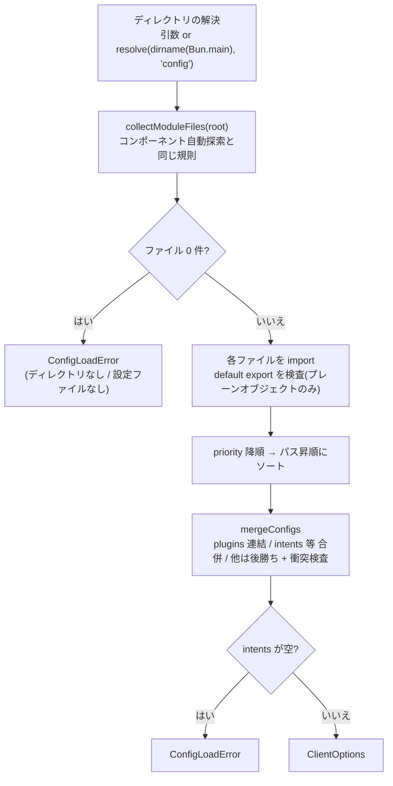

# 設定ディレクトリの合成の内部

`config/` 規約(`createClient` / `loadClientConfig` / `defineConfig`)の
内部実装を解説します。すべて [`src/config.ts`](../../src/config.ts) に
あります。利用者向けの使い方は公式サイト側にあります — ここでは合成の
正確な規則と、実装がそうなっている理由を扱います。

## 全体の流れ



`createClient(directory?, overrides?)` はこの結果に `overrides` を
**浅い後勝ち** で重ねて `new Client(...)` を呼ぶだけです。`load()` は
しません — `login()`(内部で `load()`)まで副作用は起きません。
`overrides` には合成規則も衝突検査も適用されない点に注意してください:
`plugins` を渡せば連結済みの配列ごと、`intents` を渡せば合併済みの値ごと
置き換わります(テストや一時上書きの逃げ道という位置づけです)。

## 対象ファイルと読み込み順

対象ファイルは [`collectModuleFiles`](../../src/discovery.ts) —
コンポーネント自動探索と **同じ実装** — で決まります(再帰走査、
`_` 始まりのファイル・ディレクトリと `*.d.ts` / `*.test.*` / `*.spec.*` の
スキップ、パスのソート)。

読み込み順は **`priority` の降順 → パスの昇順** です:

```ts
entries.sort((a, b) => b.priority - a.priority || comparePaths(a.path, b.path));
```

パスまで比較しておくことで、sort の安定性に頼らずに読み込み順が決まります。
`priority` は:

- 未指定なら `0`。
- **有限数のみ**。`NaN` は `typeof` が `"number"` のまま比較関数を壊す
  (常に false になりソート順が不定になる)ため、`Number.isFinite` で
  検査して `ConfigLoadError` にします。
- ローダーが消費し、結果の `ClientOptions` には残しません。

## import 時の検査

各ファイルの default export は **プレーンオブジェクト**
(オブジェクトリテラル or `Object.create(null)`)でなければなりません。
クラスインスタンスを弾くのは、`Object.entries` が getter を拾えず
「書いたつもりの設定が黙って落ちる」ためです。エラーメッセージは
「設定でない共有コードは `_` 始まりのファイルへ」という案内を含みます。

import 自体の失敗は `cause` 付きの `ConfigLoadError` にラップされます。

## 3つの合成規則(`mergeConfigs`)

| キー | まとめ方 |
| --- | --- |
| `plugins` | **連結**。読み込み順に並び、1ファイル内の配列順は保たれる。この並びがそのままプラグインの install 順になる |
| `intents` / `partials` / `applicationGuildIds` | **合併**(union)。重複は除かれる |
| それ以外 | **後勝ち**。ただし2つ以上のファイルが同じキーに **違う値** を書いていたらエラー |

実装上の要点:

- **衝突検査は `Object.is`** です。同じ内容のオブジェクトリテラルでも
  別の値として失敗します — どちらが採用されるか読めない設定は、そもそも
  書き間違いだからです。エラーには両方のファイルパスが出ます
  (最初に書いたファイルを `origins` マップで覚えています)。
- **明示的な `undefined` は「書いていない」と同じ扱い** です
  (`value === undefined` で continue)。
- `intents` は discord.js が受け付ける表記(ビット値・配列・
  `IntentsBitField`)をそのまま溜めておき、最後に
  `new IntentsBitField(intents)` でまとめて合併します。
- `partials` と `applicationGuildIds` は **配列であることを検査** します。
  単体の値を for-of すると素の `TypeError` になり、文字列なら黙って
  1文字ずつに砕けて Discord API の段で謎の失敗になるためです。
- 合併結果の `intents` が **未定義または空**(`bitfield === 0`)なら
  `ConfigLoadError` です。宣言が1つも無い場合も `intents: []` ばかりの
  場合も、ゲートウェイ接続の段ではなくここで止めます。エラーには
  読み込んだ全ファイルのパスが出ます。

## `Bun.main` への依存

既定値が2つ、`Bun.main`(プロセスのエントリファイル)から導かれます:

| 既定値 | 導出 | 実装 |
| --- | --- | --- |
| 設定ディレクトリ | `resolve(dirname(Bun.main), "config")` — `src/index.ts` に対する `src/config/` | `config.ts` の `resolveConfigDirectory` |
| `baseDirectory`(自動探索ルート) | `dirname(Bun.main)` | `client.ts` の `resolveBaseDirectory` |

**両者に依存関係はありません** — 設定ディレクトリを引数で別の場所へ
移しても、自動探索は `Bun.main` 基準のまま動きます。ただしどちらも
`Bun.main` 由来なので、**エントリファイルを移動すると両方が一緒にずれ**、
自動探索は「エラーも出さずに全ストアが空」になります。設定ディレクトリの
ほうは「ファイルが1つもない」で fail-fast しますが、`new Client` 直書きの
構成では黙って空になる点がレビュー観点です。

`Bun.main` が無い状況(埋め込み実行など)では、設定ディレクトリは
推測できないため `ConfigLoadError`(ディレクトリを明示せよという案内付き)、
`baseDirectory` は `null`(自動探索なし)になります。

`config` という名前のストアは存在しないため、`src/config/` が
コンポーネント自動探索に拾われることはありません。

## 起動時に失敗するもの(まとめ)

すべて Discord へ接続する前、`createClient()` / `loadClientConfig()` の
時点で `ConfigLoadError` になります:

- 設定ディレクトリが無い、または設定ファイルが1つもない
- 設定ファイルの import に失敗した
- default export がプレーンな設定オブジェクトでない
- `priority` が有限数でない
- `partials` / `applicationGuildIds` が配列でない
- 2つのファイルが同じキーに違う値を書いている(両方のパスを表示)
- どの設定ファイルにも空でない `intents` が無い

この検査群は[ミューテーション検証](../development/validation.md#ミューテーション検証の文化)
の主対象でもあります — 検査を1つ外したらどのテストが赤くなるか、が
[`tests/config.test.ts`](../../tests/config.test.ts) で固定されています。
