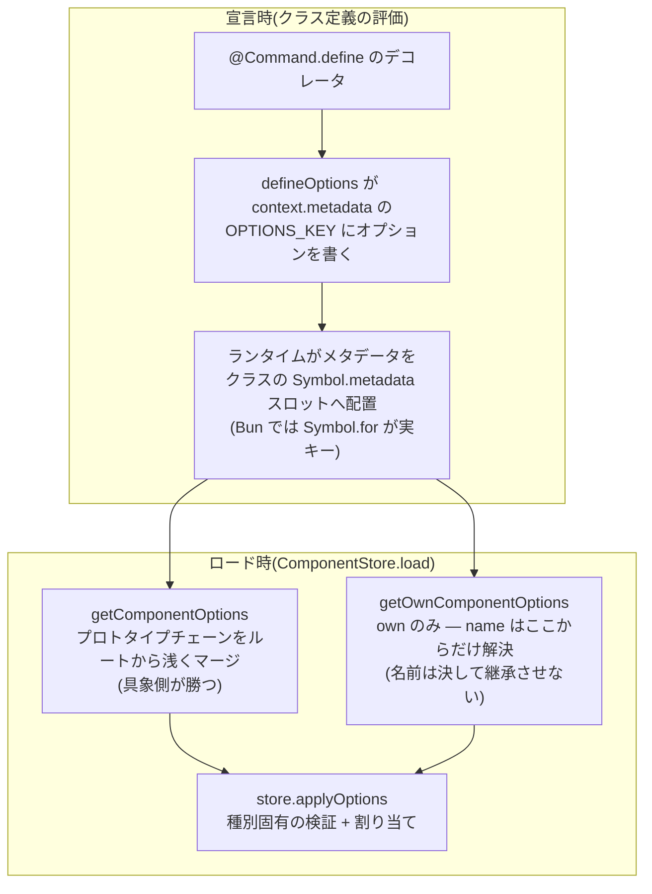

# デコレータとメタデータの内部

フレームワークは **標準(TC39 / TypeScript 5+)デコレータ** だけを使います
— legacy な `experimentalDecorators` でも `reflect-metadata` でもありません。
実装はすべて
[`src/component/metadata.ts`](../../src/component/metadata.ts) にあります。

原則は1つです: **デコレータは宣言、ローダーが実行。**
`@X.define({...})` はクラスのデコレータメタデータ(`context.metadata`)に
オプションを書くだけで、I/O をせず、何も登録せず、ストアにも触れません。
読むのはクライアントのロード時のローダーです。そのためコンポーネント
ファイルの import は完全に副作用フリーです。

## パイプライン全体



## 2つのキー

```ts
export const METADATA_KEY: symbol =
	(Symbol as { metadata?: symbol }).metadata ?? Symbol.for("Symbol.metadata");

const OPTIONS_KEY = Symbol.for("cc-discord-framework.componentOptions");
```

- `OPTIONS_KEY` — メタデータオブジェクトの中でコンポーネントオプションを
  保持するキー。登録シンボル(`Symbol.for`)なので、フレームワークが
  複数インスタンス読み込まれても一致します。
- `METADATA_KEY` — クラス側のスロット。Bun(と、Bun が実行する tsc の
  ESNext 出力)は `Symbol.metadata` を実装せず、登録シンボル
  `Symbol.for("Symbol.metadata")` を実キーにするため、両対応にしています。

さらに [`src/index.ts`](../../src/index.ts) の先頭で相互運用のための
ポリフィルを行っています:

```ts
(Symbol as { metadata?: symbol }).metadata ??= Symbol.for("Symbol.metadata");
```

TypeScript のネイティブデコレータ出力と Bun はどちらも
`Symbol.for("Symbol.metadata")` にメタデータを紐付けるので、well-known
symbol を参照する外部ツールもこれで同じ場所を見ます。

## `defineOptions` — すべての `define` の実体

すべての `X.define(...)` デコレータ(プラグインが追加する種別のものも
含めて)の唯一のプリミティブです:

```ts
export abstract class Task extends Component {
	static define(options: TaskOptions = {}) {
		return defineOptions<Task>(options);
	}
}
```

- ジェネリクス `defineOptions<T>` により、`T` を継承していないクラスへの
  適用は **コンパイルエラー** です。`Listener<"clientReady">` のサブクラス
  に `@Listener.define({ event: "messageCreate" })` は付けられません。
  この契約は `@ts-expect-error` を使ったテスト
  ([`tests/metadata.test.ts`](../../tests/metadata.test.ts))で固定され、
  テストツリーを含む `bun run typecheck` が強制します。
- 同じクラスに複数のデコレータが積まれた場合、`defineOptions` は
  メタデータオブジェクトの **own** の値とだけマージし、継承された
  メタデータ(プロトタイプチェーン)には触れません。

## 継承のセマンティクス

実装が依存している TC39 仕様の事実(テストで固定済み):

- ランタイムはメタデータオブジェクトを **プロトタイプで連鎖** させます。
  デコレータのないサブクラスは親のメタデータオブジェクトを **継承** し、
  デコレータ付きサブクラスは「親のメタデータを prototype に持つ新しい
  オブジェクト」を得ます。
- したがって `Object.getOwnPropertyDescriptor` が「ここで宣言された」と
  「継承された」を両レベル(クラス → メタデータオブジェクト、メタデータ
  オブジェクト → オプション)で区別できます。

この上に2つの読み出し関数があります(どちらも **内部 API**):

- `getComponentOptions(cls)` — チェーンをルートから浅くマージ。
  **具象クラスに近い側が勝ち** ます。基底クラスに `preconditions` を
  宣言してサブクラスに効かせる、といった継承はこちらの経路です。
- `getOwnComponentOptions(cls)` — own のみ。`name` のような同一性
  フィールドはこちらから **だけ** 解決します — デコレータのない
  サブクラスが親の名前を黙って引き継ぎ、同名衝突で起動に失敗する事故を
  防ぐためです。

## ビルド target は ESNext を維持すること

**これはこのリポジトリで最も壊れやすい制約です。**
[`tsconfig.build.json`](../../tsconfig.build.json) にも同じ警告が
コメントで残されています。

- tsc の **ダウンレベル** デコレータ出力(target を ES2022 などに下げた
  場合)は、実行時に `Symbol.metadata` が存在することを前提に
  `context.metadata` をゲートします。
- Bun には `Symbol.metadata` が存在しません(実キーは
  `Symbol.for("Symbol.metadata")`)。
- 結果、target を下げると **エラーも出ずにメタデータが消えます** —
  すべての `@X.define` が無言で無効になり、「説明のないスラッシュ
  コマンド」のような **間接的な** ロードエラーとして現れます。

ESNext 出力はネイティブのデコレータ構文を保ち、Bun 自身がそれを実行して
`Symbol.for("Symbol.metadata")` にメタデータを載せます。フレームワークも
同じキーで読むため、「Bun がトランスパイルした src」と「tsc がビルドした
dist」は相互運用できます。

デコレータまわりに触れたら、`bun test` に加えて **dist のスモーク実行**
(ビルドした `dist/index.js` を import してコンポーネントがロードされる
ことの確認)まで行ってください。src 経路(`exports` の `"bun"` 条件)
だけでは dist 経路の退行に気づけません。

## 種別ごとの必須メタデータ

デコレータ自体は必須ではありません — 基底クラスを継承していれば
コンポーネントとして成立します。必須なのは種別ごとのメタデータで、
検証は各ストアの `applyOptions` が行います:

| 種別 | デコレータなしの場合 |
| --- | --- |
| `Command`(メッセージ専用) | OK — 名前はクラス名から導出 |
| `Command`(スラッシュ) | 起動時エラー — 1〜100文字の `description` が必須 |
| `Listener` | 起動時エラー — `event` が必須 |
| `Precondition` / `Service` | OK — 名前はクラス名から導出 |

必須メタデータの欠如は、実行時に黙って壊れるのではなく、必ず起動時に
`ComponentLoadError` として正確なメッセージで失敗します。
