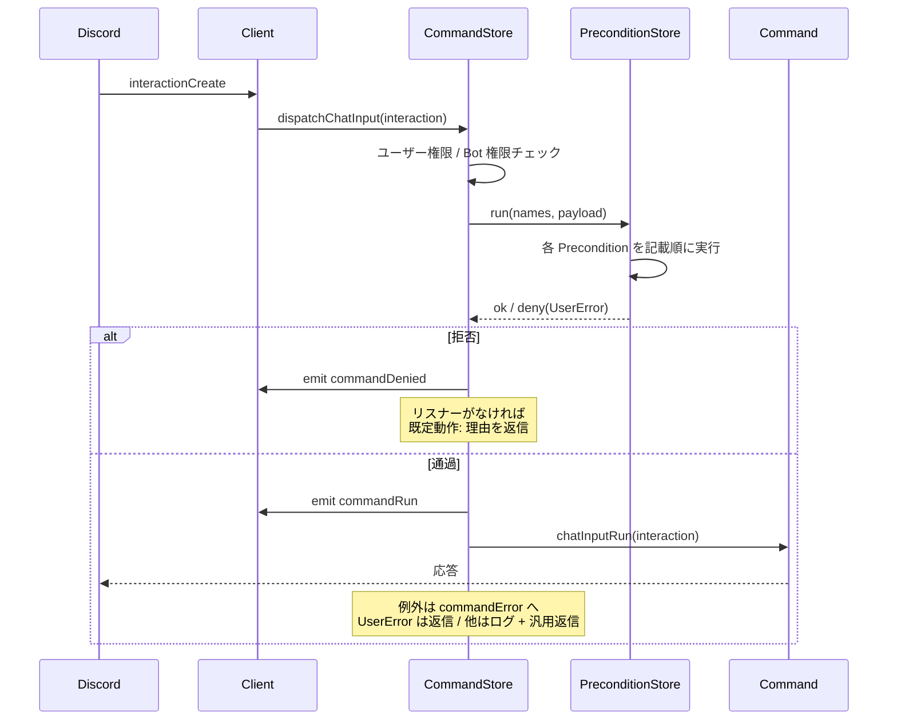

# ディスパッチ

コマンドの実行経路とリスナーの配線、そして「既定動作」のイディオムを
解説します。実装は
[`src/command/CommandStore.ts`](../../src/command/CommandStore.ts) と
[`src/listener/ListenerStore.ts`](../../src/listener/ListenerStore.ts)
です。

## クライアント側の配線

`client.load()` の最終段([ライフサイクル](./lifecycle.md))で、
クライアントは次を接続します:

- `interactionCreate` — 常時。`isChatInputCommand()` なら
  `dispatchChatInput`、`isAutocomplete()` なら `dispatchAutocomplete` へ。
- `messageCreate` — **メッセージコマンドが有効(`fetchPrefix` 指定、
  または `defaultPrefix` が非 null)か、メンションコマンドが1つでもある
  ときだけ**。まず `dispatchMention(message)` を試し、消費されなければ
  `fetchPrefix(message, container)` を解決して
  `dispatchMessage(message, prefixes)` を呼びます(メンションが最優先)。
  `fetchPrefix` が `null` を返せばそのメッセージでは無効です。
  `fetchPrefix` 自体の例外はログに落ち、Bot は落ちません。

## CommandStore のロード時の仕事

ディスパッチの前提になる検証と索引は、ロード時に済ませています:

- `applyOptions` — メタデータの割り当てに加え、**スラッシュ対応コマンド**
  (`chatInputRun` を実装しているもの)は名前が Discord の命名規則
  (`/^[-_\p{L}\p{N}]{1,32}$/u` かつ小文字)を満たすこと、1〜100文字の
  `description` を持つことを検証します。違反は `ComponentLoadError` です。
- `bind` — 名前と `aliases` を **小文字化してインデックス**
  (`#index`)へ登録します。別コマンドとの名前 / 別名の衝突はロード時
  エラーです。`unbind` がインデックスから取り除きます。メンション対象
  (`mentions` の解決結果: `"self"` またはユーザー ID)も同様に
  `#mentionIndex` へ登録し、対象の重複はロード時エラーです。
- `validateReferences(preconditions)` — 全ストアのロード後にクライアントが
  呼び、ロードされていない Precondition を参照するコマンドを
  `ComponentLoadError` にします(fail-fast)。

## 実行経路

### スラッシュ(`dispatchChatInput`)

`interaction.commandName` でストアを引き、`chatInputRun` があるものだけを
処理します。ゲート → `commandRun` 発火 → 実行、例外は
`#handleError` へ。

### メッセージ(`dispatchMessage`)

1. **Bot・Webhook・本文なしは無視**します。
2. プレフィックスは **最長一致** で選びます(`"!"` と `"!!"` が重なる
   場合に正しく解析するため)。
3. 残りを空白で分割し、先頭語を `lookup()`(小文字化した名前・別名の
   インデックス)で検索。`messageRun` があるものだけを処理します。
4. 以降はスラッシュと同じ: ゲート → `commandRun` 発火 → 実行。

### メンション(`dispatchMention`)

1. **Bot・Webhook・本文なしは無視**します。
2. `#mentionIndex` の各対象(`"self"` は `client.user.id` に解決)を
   `<@id>` / `<@!id>` の形で **本文そのもの** から探します
   (`message.mentions` を見ないのは、リプライのピンで誤発火させない
   ためです)。
3. 複数マッチしたら **本文で最初に現れた** 対象のコマンドを1つだけ
   実行します。対象のメンションを本文から取り除いて trim したものが
   `content` として渡ります。
4. 以降は他と同じ: ゲート(Precondition は `messageRun` フロー)→
   `commandRun` 発火(payload は `type: "mention"`)→ 実行。
5. 対象にマッチした時点で「消費した」扱い(戻り値 `true`)になり、
   プレフィックス解析には回りません — 拒否や実行失敗でも同じです。

### autocomplete(`dispatchAutocomplete`)

ゲートは **通しません**(補完はコマンド実行ではないため)。例外は
`commandError` イベントへ流れ、誰も購読していなければコマンドの
ロガーへ記録されるだけです — ユーザーへの返信は行いません。

## ゲート(`#gate`)

呼び出しごとに順番に評価し、**最初の拒否が勝ちます**。拒否は
`UserError`(`identifier` 付き)になります:

1. `requiredUserPermissions` — ギルド内でのみ検査。設定されているのに
   ギルド外(DM など)から呼ばれた場合は `texts.guildOnly` で拒否
   (identifier: `userPermissions`)。不足があれば
   `texts.missingUserPermissions(missing)`。
2. `requiredClientPermissions` — 同上(identifier:
   `clientPermissions`)。メッセージ経路では **チャンネル単位** の権限
   (`channel.permissionsFor(me)`)を見ます。
3. 名前付き Precondition — `PreconditionStore.run(names, payload)` が
   **記載順に** 実行し、最初の拒否で停止します。呼び出されたフロー
   (`chatInputRun` / `messageRun`)を Precondition が実装していない
   場合は `FrameworkError` — 黙って通過するガードは存在しません。

権限情報そのものが取得できない場合は、権限名の代わりに
`texts.unknownPermissions` だけを載せた一覧として「不足」扱いします。

ゲートがユーザーへ返す文言はすべて `container.texts`
([`src/texts.ts`](../../src/texts.ts) の `ClientTexts`)から取ります。
**このカタログを経由せずに文言をハードコードしてはいけません** —
利用者が `new Client({ texts: {...} })` で項目ごとに差し替えられることが
契約です。



## 既定動作のイディオム

すべての既定動作は同じ1行に基づいています:

```ts
const handled = this.container.client.emit(FrameworkEvents.CommandDenied, error, payload);
if (handled) return;
// リスナーがいなければ、ここで既定動作を適用する
```

Node の `EventEmitter#emit` は **リスナーが存在したか** を返すので、
「そのイベントのリスナーが1つもないときだけ既定動作」を設定フラグなしで
実現できます。利用者はリスナーを登録するだけで既定動作を完全に
置き換えられます。プラグインがイベントを発火するときも同じ形に
してください([サービスとイベント](../plugin-development/services-and-events.md))。

| イベント | 既定動作 |
| --- | --- |
| `commandDenied` `(error: UserError, payload)` | 呼び出した本人へ理由を返信(スラッシュはエフェメラル) |
| `commandError` `(error, payload)` | `UserError` → メッセージを返信 / それ以外 → 構造化ログ + `texts.commandError` の汎用返信 |
| `commandError`(autocomplete 由来) | コマンドのロガーへ記録のみ(返信しない) |
| `listenerError` `(error, listener)` | 構造化ログ |

返信ヘルパー `#replyTo` は、スラッシュでは `deferred / replied` の状態を
見て `reply` と `followUp` を使い分け(どちらもエフェメラル)、
メッセージでは `allowedMentions: { repliedUser: false }` で返信します。
**返信自体の失敗も warn ログに落とすだけ** で、二次エラーを投げません。

## ListenerStore

- `applyOptions` — `event` が非空文字列であることを検証(なければ
  `ComponentLoadError`)。`once` の既定は `false`。
- `bind` — リスナーごとにハンドラ関数を作って `WeakMap` に保持し、
  `client.on` / `client.once` で購読します。`unbind` が `client.off` で
  解除します(`client.destroy()` で全解除)。
- ディスパッチはハンドラ内で `await listener.run(...)` を try/catch します。

### エラーの隔離

リスナーが例外を投げても Bot は落ちず、同じイベントの他のリスナーは
そのまま動き続けます。例外は `listenerError` イベントとして発火し、
誰も購読していなければリスナーのロガーへ記録されます。

ループ防止が1つあります: **`listenerError` 自体を購読しているリスナーが
投げた場合は再発火せず**、直接ログされます。

## アプリケーションコマンド同期(`syncApplicationCommands`)

ready 後(`clientReady` の once フック)に、スラッシュ対応コマンドを
**一括上書き**(`application.commands.set`)で登録します:

- コマンドの `guildIds`、無ければクライアントの `applicationGuildIds` が
  あれば **ギルド毎に** 登録(即時反映・開発向き)。
- どちらも無ければ **グローバル** 登録。
- ペイロードは各コマンドの `toApplicationCommand()` が作ります —
  メタデータが扱わない API フィールドはコマンド側でオーバーライドして
  追加できます([`src/command/Command.ts`](../../src/command/Command.ts))。
- 完了で `commandsSynced` を発火し、`{ global, guilds }` の件数を
  ログします。ready 前に呼ぶと `FrameworkError` です。
