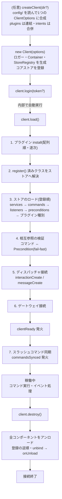
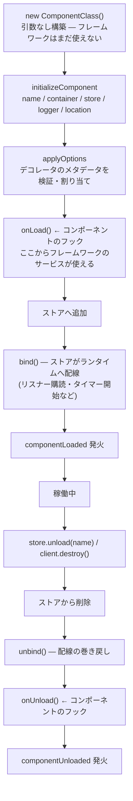

# ライフサイクル

フレームワークには2つのライフサイクルがあります: **クライアント**
(プロセス全体)のライフサイクルと、**コンポーネント**(1つのクラス)の
ライフサイクルです。すべてのフックはこの2つの上に定義されます。
実装は [`src/client.ts`](../../src/client.ts) と
[`src/component/ComponentStore.ts`](../../src/component/ComponentStore.ts)
にあります。

## クライアントのライフサイクル

先頭の設定読み込みの段は[設定ディレクトリ](./config-loading.md)を使う場合
だけのものです。それが構築より **前** に来るのは、`plugins` 配列が
クライアントの構築時点で確定するからです。`new Client({...})` を直接書く
場合はこの段が無いだけで、以降はまったく同じです。

各フェーズの要点:

| フェーズ | 起きること | 介入できる場所 |
| --- | --- | --- |
| 設定の読み込み(任意) | `config/` を読んで1つの `ClientOptions` に合成。**構築より前** | 設定ファイル(`defineConfig`) |
| 構築 | ロガー・Container・ストアの生成。**I/O なし** | `ClientOptions` |
| プラグイン install | ストア追加・サービス提供・コンポーネント同梱 | `Plugin.install(client)` |
| ストアのロード | 明示登録分 → ファイル自動探索。**services が最初** | コンポーネントの `onLoad` |
| 検証 | 未知の Precondition 参照などを起動時に検出 | —(失敗は throw) |
| 稼働中 | ディスパッチ、フレームワークイベント | リスナー、イベントの既定動作の置き換え |
| destroy | 逆順アンロード → 接続破棄 | コンポーネントの `onUnload` |

## `#doLoad` の内部(単一飛行と `#started`)

`load()` はメモ化した Promise によるシングルフライトです:

- `load()` は冪等(`this.#loading ??= this.#doLoad()`)。
- `login()` は `await this.load()` してからゲートウェイへ接続。
- `destroy()` は **進行中の `load()` を先に待ってから** 巻き戻します —
  起動途中で破棄が走ることはありません(`load()` 自体の失敗は `load()` の
  呼び出し元に伝わります)。

`register()` の「ロード開始済みか」の判定には、`#loading` とは **別の**
同期フラグ `#started` を使っています。これは実際に踏んだバグの跡です:

> `#loading` への代入は `#doLoad()` が最初の `await` に達したあとに
> 行われます。そのため `#loading` だけを見ていると、**最初のプラグインの
> `install()` からの `register()` だけ** がキューへ回り、他のプラグインの
> 分より後にロードされていました — つまり `plugins` 配列での位置が、
> 暗黙にサービスのロード順を変えていました。

`#started` は `#doLoad()` の先頭で(最初の `await` より前に)同期的に
立つので、どのプラグインの `register()` も同じ扱いになり、コンポーネントの
ロード順は install 順と一致します([`src/client.ts`](../../src/client.ts)
の `#started` のコメント参照)。

順序のそのほかの決めごと:

- **プラグインの install は配列順・逐次**(`await` しながら1つずつ)。
- **ストアのロードは登録順・逐次**です。ロードイベントと失敗を決定的に
  するためで、`services` が最初に登録されるので、他コンポーネントの
  `onLoad` からサービスを安全に使えます。
- ディスパッチャの配線は `interactionCreate` が常時、`messageCreate` は
  プレフィックス設定時(`fetchPrefix` 指定または `defaultPrefix` が
  非 null)のみです。
- スラッシュコマンド同期は `clientReady` の `once` フックで、
  `syncApplicationCommands: false` なら何もしません。同期の失敗は
  ログに残るだけで起動は続きます。

## コンポーネントのライフサイクル

`onLoad` / `onUnload` はコンポーネント側のフック、
`applyOptions` / `bind` / `unbind` は **ストア側** のフックです —
後者は種別を自作するときにオーバーライドします
([コンポーネント種別の追加](../plugin-development/component-kinds.md))。

失敗時の扱いは正確に決まっています
([`ComponentStore.load`](../../src/component/ComponentStore.ts)):

- コンストラクタ・`applyOptions`・`onLoad` の例外 →
  `ComponentLoadError` として **起動時に失敗**(fail-fast)。
  コンストラクタの失敗は「引数なしで構築し、初期化は `onLoad` で」という
  案内付き、`onLoad` の失敗はコンポーネント名とロード元パス付きで
  ラップされます。
- `bind` の例外 → コンポーネントをストアから delete した後、`unbind` と
  `onUnload` を実行してロールバックし、元の例外を再スローします。
  `onLoad` が開いた接続やタイマーも起動失敗後に残りません。
- `unload` は鏡像です: delete → `unbind()` → `await onUnload?.()` →
  `componentUnloaded` 発火。

構築時の契約: コンポーネントのコンストラクタ(およびフィールド初期化子)
では `this.container` / `this.services` / `this.logger` は **まだ使えません**。
フレームワークに依存する初期化はすべて `onLoad` で行います。

## イベントのタイミング早見表

| イベント | 発火するフェーズ |
| --- | --- |
| `componentLoaded` / `componentUnloaded` | ストアのロード中 / アンロード時 |
| `clientReady` | ゲートウェイ接続後 |
| `commandsSynced` | ready 後の同期完了時 |
| `commandRun` / `commandDenied` / `commandError` | コマンド実行のたび([ディスパッチ](./dispatch.md)) |
| `listenerError` | リスナーが例外を投げたとき |

フレームワークイベントは通常の discord.js エミッターに乗るため、
`Listener` コンポーネントでライフサイクル自体を観測できます —
例えば `componentLoaded` のリスナーは、自分より後にロードされる
すべてのコンポーネントを見ることができます(ロードは登録順のため)。
