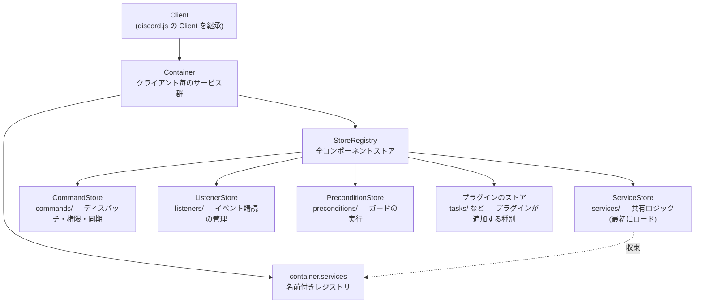
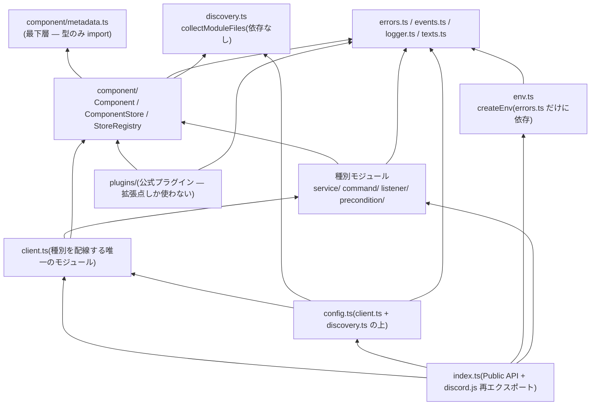

# アーキテクチャ概要

フレームワークの内側を開発者視点で解説します。利用者向けの概念解説は
公式サイトにあります — ここではモジュール構成、依存の規則、コードが
維持する不変条件を扱います。

## 設計思想(コードが従っている原則)

- **規約が構造を決める。** 決められたディレクトリ + 名前でクラスを置けば、
  フレームワークが自動でインポートして制御します。
- **小さなコアと本物の拡張点。** コアが持つ種別はサービス・コマンド・
  リスナー・Precondition だけです。定期実行や音楽再生はプラグインの領分で、
  プラグインは **Public API だけ** で種別を丸ごと追加できます。
- **デコレータは宣言、ローダーが実行。** `@X.define({...})` はメタデータを
  書くだけで、I/O もストア操作もしません
  ([デコレータとメタデータ](./decorator-metadata.md))。
- **収束。** discord.js の全 API は `@cc-discord-framework/core` から再エクスポート
  され、サービスは `this.services.<名前>` に集まります。
- **Bun 専用。** ファイル探索は `Bun.Glob`、`Bun.main` からディレクトリ既定を
  導き、Node 互換の抽象化はありません。

## 構成要素



ロードされるあらゆる単位は **Component** です: `name`・`container`・
スコープ付き `logger`・`onLoad`/`onUnload` ライフサイクルを持ちます。
**ComponentStore** は1種別のコンポーネントを保持し、そのロードと配線を
担います。**種別**は「基底クラス + ストア」の組だけで定義されます —
だからこそプラグインはコアを変更せずに種別を追加できます
([コンポーネントシステム](./component-system.md))。

## モジュールマップ

```
src/
├── index.ts                    Public API の表面 — package exports が公開する唯一の
│                               モジュール。discord.js の再エクスポートと
│                               Symbol.metadata のポリフィルもここ
├── client.ts                   Client: オプション解決、ブートストラップ、ディスパッチ配線
├── config.ts                   config/ 規約: defineConfig / loadClientConfig / createClient
├── discovery.ts                collectModuleFiles — ディレクトリ規約の共通ファイル収集
├── env.ts                      createEnv — 環境変数の型付き読み出し(EnvReader / EnvOptions)
├── container.ts                Container + 内部イニシャライザ
├── plugin.ts                   Plugin インターフェース、definePlugin
├── texts.ts                    ClientTexts — フレームワークがユーザーへ返す文言のカタログ
├── errors.ts                   FrameworkError / ComponentLoadError / ConfigLoadError / UserError
├── events.ts                   FrameworkEvents 定数、ペイロード型、
│                               discord.js ClientEvents の宣言マージ
├── logger.ts                   resolveLogger(pino オプション → インスタンス)
├── component/
│   ├── metadata.ts             デコレータメタデータの基盤(標準デコレータ)
│   ├── Component.ts            基底クラス + 内部 initializeComponent
│   ├── ComponentStore.ts       汎用ストア: ロード、自動探索、ライフサイクル
│   └── StoreRegistry.ts        ストア集合、クラス→ストア解決、Stores インターフェース
├── service/
│   ├── Service.ts              基底 + Services インターフェース
│   └── ServiceStore.ts         名前付きレジストリ(container.services の実体)
├── command/
│   ├── Command.ts              基底 + CommandOptions + define
│   └── CommandStore.ts         ディスパッチ、ゲート(権限 / Precondition)、同期
├── listener/
│   ├── Listener.ts
│   └── ListenerStore.ts        購読の管理、エラー隔離
└── precondition/
    ├── Precondition.ts         基底 + Preconditions インターフェース + 結果型
    └── PreconditionStore.ts    ガードの実行
```

公式プラグインはコアの外 — `plugins/*` の独立したワークスペース
パッケージです。コアの `src/` にプラグインのコードは1行もありません
([モノレポ構成](../development/monorepo.md))。

```
plugins/
├── utils/                      @cc-discord-framework/utils
│   └── src/                    Task 種別 + テーマ / UI / 整形ヘルパー(依存なし)
├── ai/                         @cc-discord-framework/ai
│   └── src/                    AiTool 種別 + AiService(Vercel AI SDK)
├── music/                      @cc-discord-framework/music
│   └── src/                    TrackResolver / StreamProvider 種別 + 再生エンジン
└── music-sources/              @cc-discord-framework/music-sources
    └── src/                    YouTube / SoundCloud(music の種別へ外から登録)
```

## モジュール間の依存

矢印 = 依存する側 → される側:



依存の規則:

- `component/metadata.ts` が最下層: 型しか import しません。
- `discovery.ts` も最下層です(`node:fs` / `node:path` と `Bun.Glob` だけ)。
  `ComponentStore` の自動探索と `config.ts` の設定読み込みが、同じ
  `collectModuleFiles` を共有します。
- `config.ts` は `client.ts` の **上** です: 設定を合成して
  `new Client(...)` を呼ぶ側であり、`client.ts` は設定ディレクトリの存在を
  知りません。
- `env.ts` は `errors.ts`(`required()` の `ConfigLoadError`)にしか
  依存しません。モジュールレベルの状態も持たず、警告は `createEnv()` が
  返すインスタンスに閉じています — テストは偽の `source` を渡すだけです。
- 種別モジュール(`command/` `listener/` `precondition/` `service/`)は
  `component/`・`errors`・`events` に依存し、`client.ts` には依存しません。
- `client.ts` は種別を配線する唯一のモジュールです。その上にいるのは
  `config.ts` と `index.ts` だけです。
- `plugins/` は公開パッケージ名(`@cc-discord-framework/core`)で import し、
  拡張点しか使いません(サードパーティと同じ立場のコードです)。
- ランタイムの循環 import はゼロ。型のみの循環(`Component ↔
  ComponentStore` など)は明示的な `import type` です。

## Public API の境界

[`src/index.ts`](../../src/index.ts) から export されているものがすべての
Public API です — package の `exports` により、それ以外へは到達できません。
「モジュールから export されているが `index.ts` からされていない」もの
(`initializeComponent`、`getComponentOptions` など)は内部 API であり、
自由に変更されます。

この境界には運用上の意味があります:

- **プラグインは Public API しか使えない**(公式プラグインも同じ)。
  内部 API に依存したプラグインは書けません — 深い import が package
  `exports` で塞がれているためです。
- **内部 API のリファクタリングは破壊的変更ではありません。**
  `index.ts` の export と、そこから辿れる型の互換性だけがバージョニングの
  対象です。

## 不変条件

コードレビューで守るべき、リポジトリ全体の約束です:

- **デコレータはフレームワークの動作を実行しない** — メタデータのみ。
- **コンポーネントは引数なしで構築され**、フレームワークの状態は `onLoad`
  より前にすべて割り当てられる。
- **起動時に検出できるものは起動時に失敗させる**(fail-fast)。名前の重複、
  不正なメタデータ、未知の Precondition 参照は `ComponentLoadError` に
  なります。
- **実行時の失敗はコンポーネント単位で隔離し**、イベントとして表面化する
  ([ディスパッチ](./dispatch.md))。
- **フレームワーク内に `console.*` はない** — すべて構造化 pino ログ。
- **クライアント毎の状態は `Container` に置く** — モジュールレベルの
  可変状態は禁止(複数クライアント・並列テストで混ざるため)。
- **ユーザーへ返す文言はハードコードしない** — `ClientTexts`
  ([`src/texts.ts`](../../src/texts.ts))に集約し、すべて差し替え可能に
  しておく。
