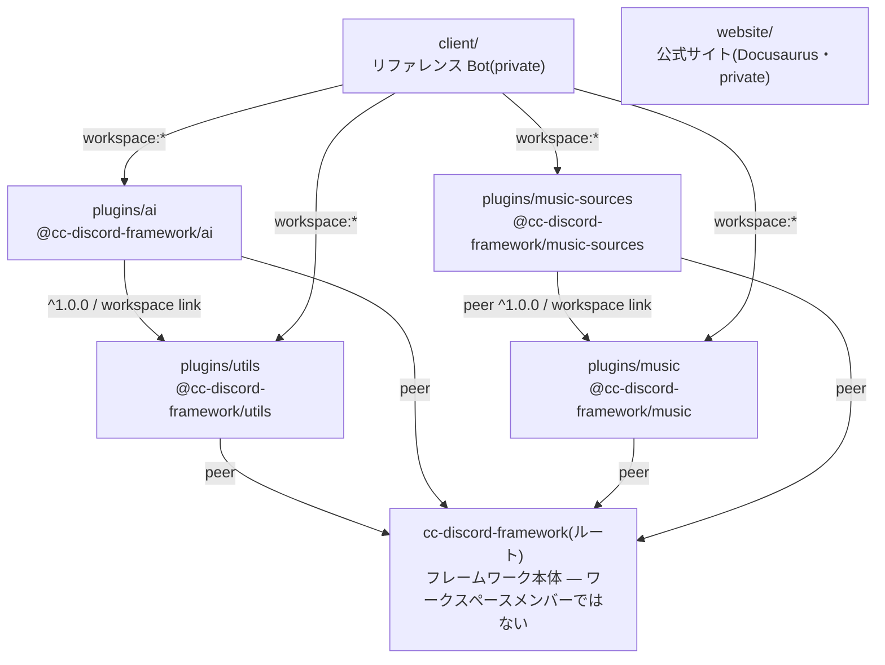

# モノレポ構成

ルートの [`package.json`](../../package.json) が定義するワークスペース:

```jsonc
"workspaces": ["client", "plugins/*", "website"]
```



## ルート = フレームワーク本体

npm パッケージ `cc-discord-framework` はリポジトリの **ルートそのもの**
です。ルートはワークスペースメンバーになれないため、他のメンバーからの
解決は開発時に明示実行する `bun run link:self` のセルフリンクで実現しています
([開発環境](./setup.md#link-selfts-の仕組み))。

## `plugins/` — 公式プラグイン

各プラグインは独立した npm パッケージで、フレームワークへは
`peerDependencies: { "cc-discord-framework": "^2.0.0" }` で依存します。
重い依存(`@discordjs/voice`、Vercel AI SDK など)をコアへ持ち込まない
ための分離です — フレームワーク本体の実行時依存は `discord.js` と `pino`
の2つだけです。

プラグイン間の依存も通常のパッケージ依存です:

- `ai` は `utils` に依存(`parseDuration` や文字数上限の定数を使うため)。
  manifest には公開可能な `^1.0.0` を書き、ローカルでは一致する
  workspace がリンクされます。
- `music-sources` は `music` に **peer** で依存(music が追加した種別へ
  コンポーネントを登録する側なので、実体は利用者側の music と同一で
  なければならない)。

プラグインはコアの **Public API しか使いません** — `plugins/` のコードは
サードパーティと同じ立場です。書き方の全体は
[plugin-development/](../plugin-development/overview.md) にあります。

## `client/` — 実運用リファレンス Bot

`client/` は「サンプル」ではなく、**実際に運用されている音楽 + AI Bot**
です。private パッケージで、公開はされません。役割は2つ:

1. **フレームワークの実運用検証。** すべてのコンポーネント種別・
   `config/` 規約・公式プラグイン4つを実際に使っています。
   `bun run check`(`src/check.ts`)がトークンなしで全ロードを検証する
   スモークチェックです([検証コマンド一覧](./validation.md))。
2. **「プラグインとクライアントの境界」の見本。** プラグインはコマンドを
   登録しない、という方針([プラグインとは何か](../plugin-development/overview.md))
   の帰結として、`/play` や `/ask` などの Bot の機能は
   `client/src/commands/` に **明示的に** 書かれています。プラグイン開発で
   「これはエンジンの能力か、Bot の機能か」に迷ったら client/ の分担を
   見てください。

import は公開時とまったく同じ `cc-discord-framework` /
`@cc-discord-framework/*` です(tsconfig `paths` は不使用)。

## `website/` — 公式サイト(利用者向けドキュメント)

`website/` は Docusaurus 製の公式サイトで、**利用者向け** の
ドキュメント(チュートリアル、概念解説、プラグインの使い方、API
リファレンス)はすべてこちらにあります。この `docs/` は開発者向けに
限定されています。

- 開発サーバー: `bun run website:dev`(ルートから)
- ビルド: `bun run website:build`
- リリース時のバージョンスナップショットは
  [リリース手順](../release/process.md#website-のバージョンスナップショット)を
  参照してください。

## テストの配置

- フレームワークのテスト: ルートの `tests/`
- プラグインのテスト: 各 `plugins/<name>/tests/`

ルートで `bun test` を実行すると、**両方がまとめて** 走ります(Bun は
カレントディレクトリ以下の `*.test.ts` を再帰的に発見するため)。
特定プラグインだけ回すときはそのディレクトリで `bun test` を実行します。
