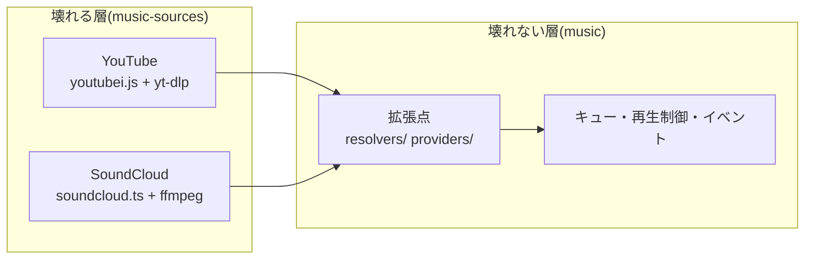

# 互換性の考え方

プラグインが「どのフレームワークで動くか」と「外部サービスの変化に
どう耐えるか」の設計指針です。

## Framework バージョンとの互換性 = peer range

プラグインの互換性宣言は `peerDependencies` の範囲がすべてです:

```jsonc
"peerDependencies": {
  "cc-discord-framework": "^2.0.0"
}
```

- `^2.0.0` は「**v2 系の Public API に依存している**」という宣言です。
  Public API とは [`src/index.ts`](../../src/index.ts) から export
  されているもの(とそこから辿れる型)だけを指します
  ([Public API の境界](../architecture/overview.md#public-api-の境界))。
  内部 API には package `exports` の段階で触れないため、「うっかり内部に
  依存していて minor で壊れる」形は構造的に起きません。
- フレームワークがメジャーを上げたら、プラグインは動作確認のうえ
  peer range を広げる(`^2.0.0 || ^3.0.0`)か、メジャーを上げて追随
  します。範囲を広げる場合は **両方のメジャーでテストが通ること** が
  条件です。
- 宣言マージ(`Stores` / `Services` / `Container` / `ClientEvents`)は
  型レベルの結合なので、フレームワーク側のインターフェース名の変更は
  破壊的変更として扱われます — 逆に言えば、プラグインはこれらの
  インターフェース名にだけ依存してください。

プラグイン自身のバージョニングも通常の semver です: 公開している
オプション(`XOptions`)・texts カタログのキー・イベント名とペイロードが
プラグインの Public API であり、これらの互換性が切れるときにメジャーを
上げます。

## 壊れやすい層の分離 — music-sources が実例

外部サービス(スクレイピング先・非公式 API・外部コマンド)に依存する
コードは、**時間とともに必ず壊れます**。このリポジトリの答えは
「壊れる層を独立したパッケージに切り出す」ことです。

実例が `@cc-discord-framework/music-sources` です
([`plugins/music-sources/src/index.ts`](../../plugins/music-sources/src/index.ts)の
方針コメント):

> `@cc-discord-framework/music` は「壊れない音源」(直リンク・ラジオ・
> Internet Archive・ローカル)だけを同梱しています。YouTube や
> SoundCloud は各サービスの都合で **定期的に壊れる層** なので、独立した
> パッケージに分けてあります。壊れたときはこのパッケージ(と yt-dlp)
> だけを更新すればよく、キューや再生制御の資産には影響しません。



この分離を支えている設計判断:

- **安定層は拡張点(コンポーネント種別)だけを公開する。** music の
  `TrackResolver` / `StreamProvider` という2種別が境界で、壊れる層は
  「外からコンポーネントを登録するだけ」の存在です。安定層のコードは
  YouTube を知りません。
- **壊れる層の中でも、壊れる軸で分ける。** music の種別が Resolver
  (何を再生するか — メタデータ・プレイリスト展開)と Provider
  (どこから音を取るか)に分かれているのは、**壊れるのは常に Provider 側**
  (音源サイトの仕様変更)だからです。Provider を差し替えるだけで復旧
  でき、Resolver 側の資産は失われません。
- **最も頻繁に更新が要るものはパッケージにすら入れない。** yt-dlp は
  同梱せずシステム側(PATH 上)に置き、`Bun.which` で見つからなければ
  警告して続行します。yt-dlp の更新サイクルは npm パッケージのリリース
  より速いためです。
- **壊れる層は peer で安定層につなぐ。** music-sources は music に
  peer 依存です — 利用者の music と同一インスタンスでなければ、種別への
  登録が成立しないからです。

自分のプラグインに当てはめるチェックリスト:

- [ ] 外部サービスの仕様変更で壊れうるコードはどこか、特定したか
- [ ] それは安定層(自分のエンジン・拡張点)から分離できているか
- [ ] 壊れたとき、利用者は **その層だけ** を更新すれば復旧するか
- [ ] 外部依存の不在・故障は「警告して続行」になっているか
  ([最小プラグインを0から](./creating-a-plugin.md#5-外部依存の欠如は警告して続行))

## 他のプラグインとの互換性

- 他のプラグインへの依存は、ドキュメントに明記しない限り持たないで
  ください。明記する場合はインストール順も書きます(music-sources は
  「`music()` より後に並べてください」)。
- 依存の実装は「相手の Public API(export された基底クラス・サービス・
  イベント)だけを使う」ことです。相手のコンテナ設定
  (`container.musicConfig` など)を直接読むのは、相手がそれを Public
  API として export している場合(`musicConfigOf` のようなヘルパーが
  ある場合)に限ります。
