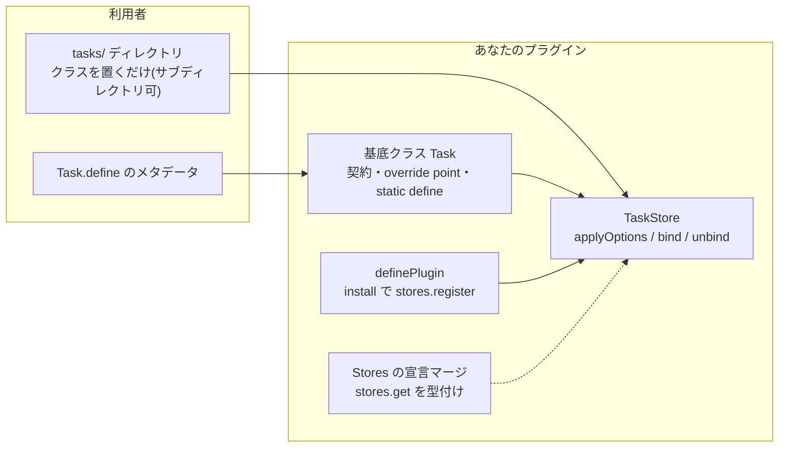

# コンポーネント種別の追加

フレームワーク中心の拡張点です: プラグインは Public API だけを使って、
独自の基底クラス・`define` デコレータ・専用ディレクトリ・ランタイム配線を
持つ新しいコンポーネント **種別** を丸ごと追加できます。利用者は
コマンドを書くのとまったく同じ体験で、あなたの種別のコンポーネントを
書けます。

このページの例はすべて公式 utils プラグインの実物
([`plugins/utils/src/scheduler.ts`](../../plugins/utils/src/scheduler.ts) —
`Task` 種別)からの抜粋です。内部の仕組みは
[コンポーネントシステム](../architecture/component-system.md)を参照して
ください。

1つの「種別」を構成する要素と、それぞれの担当:



## 1. 基底クラス

```ts
// plugins/utils/src/scheduler.ts(抜粋)
import {
	Component,
	defineOptions,
	type Awaitable,
	type ComponentOptions,
} from "cc-discord-framework";

export interface TaskOptions extends ComponentOptions {
	/** 実行間隔。ミリ秒か `"1h"` `"30m"` のような期間表記。**必須**。 */
	every: DurationInput;
	/** クライアントの ready 直後にも一度実行する。 @default false */
	runOnStart?: boolean;
	/** 前回の run() が終わっていないとき、次の周期を重ねて実行するか。 @default false */
	overlap?: boolean;
}

export abstract class Task extends Component {
	/** 解決済みの実行間隔(ミリ秒)。 */
	declare public readonly every: number;
	declare public readonly runOnStart: boolean;
	declare public readonly overlap: boolean;

	/** タスクのメタデータを宣言します。`every` は必須です。 */
	public static define(options: TaskOptions) {
		return defineOptions<Task>(options);
	}

	public abstract run(): Awaitable<unknown>;
}
```

パターンはコア種別と完全に同じです:

- オプションのインターフェースは `ComponentOptions` を継承(共通の
  `name?` が付いてきます)
- 解決済みオプションは `declare readonly` のインスタンスフィールドに
  (割り当ては後述のストアの `applyOptions` が行います)。宣言と解決で
  型を変えても構いません — 実物も `every` はオプションでは
  `DurationInput`(`"1h"` など)、フィールドでは解決済みの `number` です
- `static define` は `defineOptions<Task>` へ委譲 — この1行で、対象クラス
  を型検査する型付きデコレータが手に入ります
  ([デコレータとメタデータ](../architecture/decorator-metadata.md))

## 2. ストア

```ts
// plugins/utils/src/scheduler.ts(抜粋 — 検証メッセージ等は一部省略)
import { ComponentLoadError, ComponentStore, Events } from "cc-discord-framework";

export class TaskStore extends ComponentStore<Task> {
	readonly #timers = new Map<Task, ReturnType<typeof setInterval>>();
	/** 実行中の run()。重ね実行の抑止に使う。 */
	readonly #running = new Set<Task>();

	public constructor() {
		super({ name: "tasks", base: Task });   // <baseDirectory>/tasks/** を走査
	}

	// メタデータを検証し、解決済みフィールドを割り当てる。
	protected override applyOptions(task: Task, options: TaskOptions): void {
		let every: number;
		try {
			every = parseDuration(options.every);
		} catch (error) {
			throw new ComponentLoadError(
				`タスク "${task.name}" の実行間隔が不正です — @Task.define({ every }) に 3600000 や "1h" を指定してください`,
				{ cause: error },
			);
		}
		if (every <= 0) {
			throw new ComponentLoadError(`タスク "${task.name}" には正の実行間隔が必要です`);
		}
		Object.assign(task, {
			every,
			runOnStart: options.runOnStart ?? false,
			overlap: options.overlap ?? false,
		});
	}

	// コンポーネントをランタイムへ配線し…
	protected override bind(task: Task): void {
		const client = this.container.client;
		if (client.isReady()) this.#start(task);
		else client.once(Events.ClientReady, () => this.#start(task));
	}

	// …アンロード / 終了時に巻き戻す。
	protected override unbind(task: Task): void {
		const timer = this.#timers.get(task);
		if (timer !== undefined) {
			clearInterval(timer);
			this.#timers.delete(task);
		}
	}
}
```

ストアの契約はこの3つのオーバーライドがすべてです:

| オーバーライド | 責務 |
| --- | --- |
| `applyOptions(component, options)` | メタデータの検証と型付きフィールドの割り当て。不正は `ComponentLoadError` で **起動時に** 失敗させる |
| `bind(component)` | ロード後のランタイム配線(タイマー・購読・インデックス) |
| `unbind(component)` | アンロード時の巻き戻し(`client.destroy()` で必ず呼ばれる) |

実物からの学びどころが2つあります:

- **`bind` は ready を待ってから始動しています。** ロードは `login()` 前に
  走るので、「稼働してから動くもの」は `clientReady` を待ちます。ready 前に
  アンロードされた場合に備えて、`#start` の先頭で
  `this.get(task.name) !== task` を確かめてから始動しています。
- **検証は applyOptions で出し切ります。** 実物はさらに
  `setInterval` の 32bit 上限(超えると 1ms 連発に化ける)もここで
  弾いています — 実行時に黙って壊れるものをロード時エラーに変えるのが
  この層の仕事です。

## 3. `suffix` — ディレクトリ名とクラス名の語が揃わないとき

`super()` に渡す `ComponentStoreOptions` は3つです:

| オプション | 既定 | 意味 |
| --- | --- | --- |
| `name` | — | ストア名。そのまま自動探索ディレクトリ名(`<baseDirectory>/<name>/**` を再帰走査)。慣例として複数形 |
| `base` | — | この種別のコンポーネントが継承すべき基底クラス |
| `suffix` | ストア名の単数形 | 名前導出でクラス名から取り除く接尾辞 |

`suffix` を書くのは **ディレクトリ名とクラス名の語が揃わないときだけ**
です。`tasks/` に `Task` を置く上の例では既定(`"tasks"` → `Task`)で
足ります。公式 ai プラグインが明示する側の実例です
([`plugins/ai/src/AiTool.ts`](../../plugins/ai/src/AiTool.ts)):

```ts
public constructor() {
	// ディレクトリ名は `ai/`(`tools/` だと「誰のツールか」が判らないため)。
	// クラス名の接尾辞だけは `Tool` のまま — `NowPlayingTool` → `now-playing`。
	super({ name: "ai", base: AiTool, suffix: "Tool" });
}
```

接尾辞の除去とケバブケース化という規則そのものを変えたい場合は
`deriveName(className)` をオーバーライドします(コアの
`ServiceStore` と `PreconditionStore` が実例 —
[名前の導出](../architecture/component-system.md#名前の導出derivename-と-suffix))。

## 4. ストアと型の登録

```ts
// plugins/utils/src/index.ts(抜粋)
export function utils(options: UtilsOptions = {}): Plugin {
	return definePlugin({
		name: "utils",
		install(client) {
			client.container.theme = resolveTheme(options.theme);
			if (options.scheduler ?? true) client.stores.register(new TaskStore());
			if (options.ui ?? true) client.register(UiService);
		},
	});
}

declare module "cc-discord-framework" {
	interface Stores {
		tasks: TaskStore;
	}
}
```

`Stores` の宣言マージで `client.stores.get("tasks")` が型付きになります。
ランタイムコードと同じモジュールに置いてください。

## 5. 利用者が得るもの

```ts
// 利用者の tasks/CleanupTask.ts — 他のコンポーネントと同じく自動探索される
import { Task } from "@cc-discord-framework/utils";

@Task.define({ every: "1h", runOnStart: true })
export class CleanupTask extends Task {
	override async run() {
		this.logger.info("クリーンアップを実行します");   // container / services / logger 全部ある
	}
}
```

`client.stores.get("tasks")` は型付き、`client.register(CleanupTask)` は
正しいストアへ自動ルーティング(`StoreRegistry.resolve` がプロトタイプ
チェーンで解決)、`componentLoaded` は発火し、`client.destroy()` は
`unbind` する — フレームワークの仕組み全部が、追加作業ゼロであなたの
種別にも適用されます。

利用者側のディレクトリは再帰的に走査され、`_` 始まりのファイル・
ディレクトリは共有コードとしてスキップされます。**サブディレクトリは
整理のためだけで、コンポーネント名には影響しません。**

## 6. ストアの外で規約ディレクトリを走査する

ストアを介さず独自のディレクトリを読みたいときは、自動探索と同じ規則を
`collectModuleFiles(directory)` として呼べます(Public API):

```ts
import { join } from "node:path";
import { collectModuleFiles } from "cc-discord-framework";

if (client.baseDirectory !== null) {          // null = 自動探索が無効
	const paths = await collectModuleFiles(join(client.baseDirectory, "migrations"));
	// paths を import して、自分の規約どおりに扱う
}
```

再帰走査・`_` スキップ・テストファイル除外・決定的ソートという規則は
コンポーネント自動探索・設定ディレクトリと同一で、ディレクトリが
無ければ空配列です([実装](../../src/discovery.ts))。

## 最小の全体像

「基底クラス + ストア + 宣言マージ + install」の4点が揃った最小形は、
フレームワークのテストフィクスチャ
[`tests/fixtures/job-kind.ts`](../../tests/fixtures/job-kind.ts) に
50行で収まっています — サードパーティのプラグイン作者が書くのと同じ形で、
拡張点が Public API だけで成立することの証明として維持されています。
