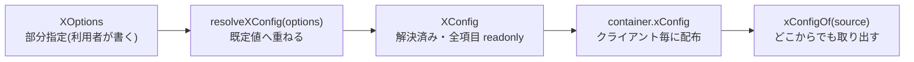

# オプション設計の規約

公式プラグインの設定はすべて同じ型と関数の組で書かれています。この規約に
従うことで、利用者はどのプラグインでも同じ書き味
(`x({ 必要な項目だけ })`)を得ます。

## 絶対規則: 差し替えられない値を作らない

先にこのリポジトリの絶対規則を置きます:

> ハードコードされていて、あとから変えたくても変えられない —
> **これは絶対にやめてください。既定値なら構いませんが、変更できないのは
> 駄目です。**

対象は色・ボタンのラベル / スタイル / 絵文字・ユーザーに見える文言・
記号・上限値・タイムアウトなど、「見た目と手触り」を決めるすべての値です。
「上書きしたければコンポーネントごと自作してください」は逃げとみなされます。

実装の指針:

- 値は必ず **既定値付きのオプション** にする(下の3点セット)。
- 見た目に関わるものは3段階の上書き経路を用意する —
  **既定値** → **プラグインオプション**(Bot 全体、コンテナ経由で
  クライアント毎に保持)→ **各呼び出しの `options`**(その場限り)。
  utils のテーマがこの形の実例です
  ([`plugins/utils/src/theme.ts`](../../plugins/utils/src/theme.ts):
  `defaultTheme` → `utils({ theme })` → 各呼び出し)。
- **「オプションを足した」だけでは終わりません。** 設定のリーフ項目を
  1つずつ「読んでいる箇所」まで追い、**設定を変えたら出力が変わることを
  テストで実証** してください。過去の監査で「設定できるのに実際には
  読まれていない」死んだ設定が複数見つかっています
  ([検証コマンド一覧](../development/validation.md))。

## 3点セット: XOptions / XConfig / resolveXConfig



実物(music —
[`plugins/music/src/config.ts`](../../plugins/music/src/config.ts)、抜粋):

```ts
/** 解決済みの設定 — すべて readonly。 */
export interface MusicConfig {
	readonly defaultVolume: number;
	readonly leaveOnEnd: number | false;
	readonly limits: MusicLimits;
	readonly texts: MusicTexts;
	// ...
}

/** 部分指定。指定しなかった項目は既定値のままです。 */
export interface MusicConfigOptions {
	/** @default 1 */
	defaultVolume?: number;
	/** @default 30000 */
	leaveOnEnd?: number | false;
	/** 数量の上限。指定した項目だけが既定値を上書きします。 */
	limits?: Partial<MusicLimits>;
	texts?: MusicTextsOptions;
	// ...
}

/** 部分指定を既定値へ重ねて、完全な設定にします。 */
export function resolveMusicConfig(options: MusicConfigOptions = {}): MusicConfig {
	return {
		defaultVolume: options.defaultVolume ?? 1,
		leaveOnEnd: options.leaveOnEnd ?? 30_000,
		limits: { ...DEFAULT_LIMITS, ...options.limits },
		texts: resolveMusicTexts(options.texts),
		// ...
	};
}

/** 何も指定しないときの設定。 */
export const defaultMusicConfig: MusicConfig = resolveMusicConfig();
```

規約の要点:

- **`XConfig` は全項目 readonly の完成形**、`XOptions` はその部分指定。
  ネストしたグループ(`limits` / `voice` / `stream` ...)は
  `Partial<グループ>` で受け、`{ ...DEFAULT, ...options.group }` で
  重ねます — **指定した項目だけが既定値を上書き** します。
- **既定値は `@default` の JSDoc で `XOptions` 側に書きます。**
  利用者がエディタ上で既定値を読めるのはこちら側だからです。
- **`defaultXConfig = resolveXConfig()`** を export します(テストと
  フォールバックのため)。
- 解決済み設定は `install` で `container.xConfig` に置き、取り出しは
  `xConfigOf(source)` ヘルパーで
  ([最小プラグインを0から](./creating-a-plugin.md#3-モジュールレベル状態の禁止))。
- **「無効」は `false` で表現** します(`leaveOnEnd: number | false`、
  `timeout: DurationInput | false`)。`0` や `null` に意味を重ねません。
- 時間の項目はミリ秒数と `"90s"` / `"1h30m"` のような期間表記の両方を
  受けます(utils の `parseDuration` / `DurationInput` を使う — ai の
  `timeout` / `ttl` / `cooldown` が実例)。解決済み側は常に `number |
  false` です。
- 既定値の選択には理由を持たせ、JSDoc に書きます。実例: ai の
  `stream.intervalMs` の既定 1.2 秒は「インタラクション応答の編集は
  おおよそ5秒あたり5回まで」という Discord の制限から、`model` の
  「既定なし」は **勝手に課金される先を既定にしない** ためです
  ([`plugins/ai/src/config.ts`](../../plugins/ai/src/config.ts))。

## texts カタログ

ユーザーに見える文言は `texts` として1ファイルに集約し、同じ
「部分指定 + resolve」の形にします。実物(music —
[`plugins/music/src/texts.ts`](../../plugins/music/src/texts.ts)、抜粋):

```ts
export interface MusicTexts {
	/** クエリに一致する音源が見つからなかった。 */
	noResult: (query: string) => string;
	/** 何も再生していない状態で再生操作が行われた。 */
	nothingPlaying: string;
	// ...
}

export const defaultMusicTexts: MusicTexts = {
	noResult: (query) => `「${query}」に一致する再生可能な音源が見つかりませんでした。`,
	nothingPlaying: "現在このサーバーでは何も再生していません。",
	// ...
};

/** {@link MusicTexts} の部分指定。指定しなかった項目は既定値のままです。 */
export type MusicTextsOptions = Partial<MusicTexts>;

/** 部分指定を既定値へ重ねて、完全な文言カタログにします。 */
export function resolveMusicTexts(options: MusicTextsOptions = {}): MusicTexts {
	return { ...defaultMusicTexts, ...options };
}
```

- 変数が入る文言は **関数** にします(`(query) => ...`)。テンプレートの
  差し替えより表現力があり、型も付きます。
- **カタログに載せてよいのは「そのプラグイン自身が出す文言」だけ** です。
  music はコマンドを持たないので、載っているのは「エンジンが失敗した
  ときにエラーへ載せる文言」だけです。コマンドの応答文言は Bot の機能
  なので、カタログを作ってはいけません
  ([境界](./overview.md#エンジンの能力とbot-の機能の境界))。
- 絵文字は文言の一部としてそのまま含めます — 絵文字だけを差し替える枠を
  別に作ると設定が二重化します(ai の texts の方針)。
- さらに進んだ形として、ai の `AiTexts.answerBody` は **本文の組み立て
  関数ごと** 差し替えられます(整形済みの断片と生の値の両方を渡す)。
  「並び順や区切りまで利用者が決められる」必要があるときの手本です
  ([`plugins/ai/src/texts.ts`](../../plugins/ai/src/texts.ts))。

コア側の同じ仕組み(`ClientTexts` — ゲート拒否やコマンド失敗の文言)は
[`src/texts.ts`](../../src/texts.ts) にあります。ディスパッチの既定動作が
使う文言は必ずここを経由します。

## 安全側の既定値

既定値は「利用者が何も考えずに使っても事故らない」側に倒します。
実例(ai の `display.allowedMentions` —
[`plugins/ai/src/config.ts`](../../plugins/ai/src/config.ts)):

```ts
// 既定は安全側 — モデルの出力をそのまま本文へ流すため。
allowedMentions:
	options.display?.allowedMentions === undefined
		? { parse: [] }
		: options.display.allowedMentions,
```

LLM の出力をそのまま Discord に流す経路では、既定でどのメンションも
解決しません — プロンプトインジェクションで `@everyone` を書かれても
発火しないためです。許可は利用者が明示します。`undefined`(未指定)と
`null`(discord.js の既定に任せる)を区別している点にも注意してください。

同じ思想の例: `splitThreshold` は利用者が明示した値でも表示方法の上限
(埋め込み 4096 / プレーン 2000)に丸めます — 超えた指定は送信が必ず
失敗し、「様式の選択」ではなく「回答が丸ごと失われる」だけだからです。
