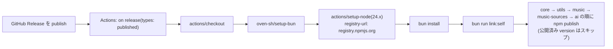

# リリース手順

フレームワーク本体(npm パッケージ `@cc-discord-framework/core`)と
公式プラグイン(`@cc-discord-framework/{utils,music,music-sources,ai}`)の
リリースフローと、その前後にやることをまとめます。

## 自動化されている部分: GitHub Release → npm publish

実体は [`.github/workflows/publish.yml`](../../.github/workflows/publish.yml)
です(2026-08 時点の全ステップ):



押さえておくべき事実:

- **トリガーは GitHub Release の published** です。タグを push しただけ
  では動きません。
- **認証は npm Trusted Publishing(OIDC)** です。トークンや secrets は
  使いません。ジョブの `id-token: write` 権限と、npmjs.com 側で各
  パッケージに登録した Trusted Publisher(repository:
  `CHACCHAN/cc-discord-framework`、workflow: `publish.yml`)の組で
  認証されます。**Trusted Publisher が未登録のパッケージの publish は
  失敗します**(登録はオーナーが npmjs.com 上で行います)。public
  リポジトリなので provenance は自動で付与されます。
- 公開対象は **コア + 4 プラグインの5パッケージ** で、依存順
  (core → utils → music → music-sources → ai)に publish します。
  `package.json` の `version` が既に npm にあるパッケージはスキップ
  されるため、一部のパッケージだけ version を上げた Release でも
  安全に実行できます。
- `npm publish` は npm の仕組みとして、ルートでは `prepublishOnly`、
  プラグインでは `prepack` を実行します。いずれも
  `bun run clean && bun run build` なので、**ビルドはワークフロー内で
  自動的に走ります**(dist を commit する必要はありません)。
- **公開されるバージョンは各 `package.json` の `version`** です。Release の
  タグ名からは取られません — タグと `version` を一致させるのは人間の
  仕事です(不一致でもそのまま publish されてしまいます)。
- 公開物は `files` フィールドどおり `dist` + `src` + `README.md`(ルートは
  さらに `CONTRIBUTING.md` / `SUPPORT.md`)です(`src` は `exports` の
  `"bun"` 条件のために必須 —
  [パッケージング](../plugin-development/packaging.md))。
- **ワークフローはテストを実行しません。** 検証はリリース前に手元で
  済ませるのが前提です(下記チェックリスト)。

## バージョニング

- ルート(フレームワーク)とプラグインは **独立したバージョン** を持ちます
  (2026-08 時点: ルート 2.0.0、各プラグイン 1.0.0)。
- semver の対象は Public API です — ルートは
  [`src/index.ts`](../../src/index.ts) の export、プラグインは
  export された型・オプション・イベント
  ([互換性の考え方](../plugin-development/compatibility.md))。
- フレームワークのメジャーを上げたら、各プラグインの
  `peerDependencies` の range 更新が必要かを必ず確認します。

## 公開前チェックリスト

1. `bun run check`(typecheck + 全テスト + build)が緑
2. `cd client && bun run typecheck && bun run check` が緑
   (実物のプラグイン構成でロードできる)
3. **dist のスモーク**: ビルドした `dist/index.js` を import して
   コンポーネントがロードされることを確認(リポジトリ内の実行はすべて
   `"bun"` 条件で src を読むため、dist の退行は意識して踏まない限り
   見えません —
   [デコレータとメタデータ](../architecture/decorator-metadata.md#ビルド-target-は-esnext-を維持すること))
4. `package.json` の `version` を上げる(タグ名と一致させる)
5. 公開対象ごとに `npm pack --dry-run` を実行し、`dist/index.js` と
   `dist/index.d.ts` が含まれ、manifest に `workspace:*` がないことを確認
6. GitHub Release を作成・publish → Actions の publish ジョブが緑に
   なることを確認

## website のバージョンスナップショット

公式サイト(`website/` — Docusaurus)は、リリースに合わせて **Stable
スナップショット** を切ります。現行ドキュメントは「Next 🚧」ラベル +
unreleased バナーで運用されており
([`website/docusaurus.config.ts`](../../website/docusaurus.config.ts))、
リリース時に次を実行します:

```sh
bun run --cwd website docusaurus docs:version <バージョン>
# 例: v2.0.0 のリリース時
bun run --cwd website docusaurus docs:version 2.0
```

これで現時点の `website/docs/` が `versioned_docs/` に凍結され、以後の
main の変更は Next にだけ載ります。スナップショット後に
`bun run website:build` が通ることを確認してからデプロイしてください。
