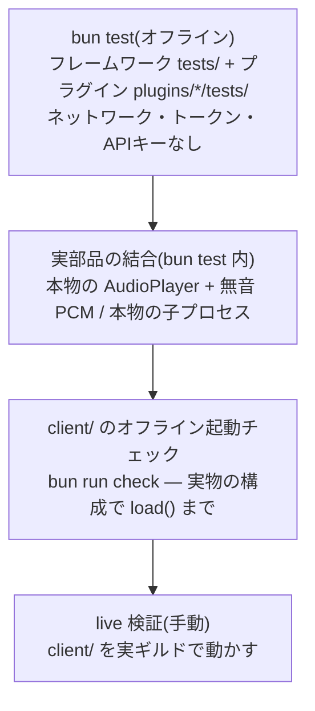

# テスト戦略

リポジトリ全体のテストの層と、それぞれが何を保証するかをまとめます。
プラグイン固有の書き方は
[プラグインのテスト](../plugin-development/testing.md)にあります。

## 層の全体像

## `bun test` — 自動テストのすべて

ルートで `bun test` を実行すると、フレームワーク(`tests/`)と全
プラグイン(`plugins/*/tests/`)のテストがまとめて走ります。全テストが
次の制約を守ります:

- **ネットワーク・Discord トークン・API キーに触れない。** クライアントは
  `login()` せず `load()` / `destroy()` だけを使い、LLM は `ai/test` の
  `MockLanguageModelV3`、外部コマンドは `bun -e` の偽プロセスで代用します。
- **決定的であること。** 自動探索・設定読み込みはパスのソートで順序が
  決まっており、テストはそれを前提にできます。

フレームワーク側のテストが固定している主なもの:

- `tests/fixtures/bot/` — **本物のファイル自動探索**(サブディレクトリ、
  `_` スキップ、命名導出)を実ディレクトリで検証
- `tests/fixtures/job-kind.ts` — Public API だけでカスタム種別が成立する
  ことの証明
- `tests/config.test.ts` + `tests/fixtures/config-*/` — 設定合成の3規則と
  失敗系(衝突・NaN priority・配列でない partials・空 intents ...)
- `tests/dispatch.test.ts` — ゲート・既定動作・texts の差し替え
- `tests/metadata.test.ts` — デコレータメタデータの継承セマンティクスと、
  `@ts-expect-error` によるコンパイル時契約(typecheck が強制)

## 実部品の結合テスト

偽物にするのは境界の外だけで、**内側の部品は本物を使います**。代表例が
music のキューです
([`plugins/music/tests/queue.test.ts`](../../plugins/music/tests/queue.test.ts)):
`@discordjs/voice` の `AudioPlayer` を本物のまま、無音 PCM
(1ms = 192 バイト)を食わせて再生・スキップ・ループ・destroy の状態遷移を
**実運用と同じ経路** で検証しています。ボイス接続だけは張れないので、
`noSubscriberBehavior` を `Play` に上書きして進行させます — この上書きが
できること自体が[設定設計](../plugin-development/configuration.md)の
成果です。

同様に、外部プロセス経路(yt-dlp のタイムアウト・kill)は bun 自身を
偽コマンドにして **本物の子プロセス生成・タイムアウト・kill** を通します。

## `client/ bun run check` — 実物構成のスモーク

`client/src/check.ts` は `index.ts` からクライアントをそのまま import し
(`import.meta.main` ガードにより login はされません)、`client.load()`
を実行します。これで検証されるのは:

- `config/` の読み込みと合成(priority・連結・合併)
- 公式プラグイン4つの install
- 全コンポーネント(コマンド17個を含む)のロードと相互参照検証
- ディスパッチャの接続

トークンもネットワークも不要です。**コアの変更が「実物のプラグイン
構成」で起動できるか** を数秒で確かめる層として、ルートの `bun test` と
組で回してください([検証コマンド一覧](../development/validation.md))。

## live 検証(手動)

自動化された live e2e はありません — Discord の実ゲートウェイ・実音源に
対する検証は、`client/` を実ギルドで動かして行います(この Bot は実際に
運用されているものです —
[モノレポ構成](../development/monorepo.md#client--実運用リファレンス-bot))。

live 検証が必要になるのは、自動テストが原理的に守れない層に触れたとき
だけです:

- 外部サービスの実挙動(YouTube / SoundCloud の仕様変更、レート制限)
- Discord API の実挙動(インタラクションの編集頻度制限、権限の実際の
  見え方)
- 音声の実再生(ドリフト・途切れ)

live で見つけた事実は、可能な限り **オフラインで再現するテストに翻訳**
してから直します。実例: 「YouTube がプレイリスト項目を別の形で返す
ようになり全項目スキップされる」障害は、実レスポンスの形を fixtures に
写して `plugins/music-sources/tests/playlist.test.ts` に固定されています。

## flaky の扱い

方針は「flaky を許容してリトライする」ではなく、**flaky の原因を設計で
消す** ことです:

- **実時間への依存を最小にする。** 待ち時間は数 ms 単位に抑え、順序は
  イベントや Promise の解決で待ちます。
- **ハングしうる偽物には保険を持たせる。** abort されるまで黙って止まる
  モックには、放置されないよう保険のタイムアウトを仕込みます(ai の
  `mockStallingStreamModel` は2秒の保険付き)。ストリームは abort されて
  いても必ず close します — 閉じないと読み手が終われず、テストが
  固まります。
- **タイミングを観測点にする場合は、偽物側に計測を仕込む。** 「編集が
  重ならない」ことは、偽インタラクションが同時実行数の最大値を記録する
  ことでアサートしています(sleep で「たぶん終わった頃」を待たない)。
- **失敗のタイミングを制御下に置く。** 「いつ失敗するか」が結果を左右する
  テストは、呼び出し側が合図するまで失敗しないモック
  (`mockManualFailingModel`)で競合を決定的にします。

それでも不安定なテストが見つかったら、リトライを足すのではなく、上の
いずれかの形に書き直してください。

## テストと一緒に守る規約

- テスト名は日本語で、**仕様を文章として読める** ようにします
  (「コマンドは登録しない(Bot の機能は client 側で書く)」)。
- 「パッケージが入っていないこと」に依存しない
  ([落とし穴](../plugin-development/testing.md#落とし穴))。
- テストが本当に効いているかは[ミューテーション検証](../development/validation.md#ミューテーション検証の文化)で
  確かめます。
