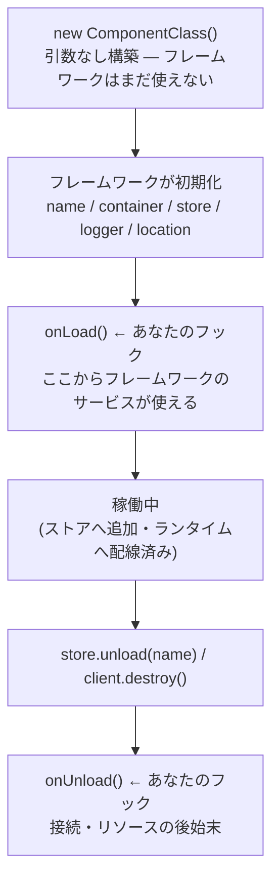

# コンポーネント

ロードされるあらゆる単位 — コマンド、リスナー、Precondition、サービス、
プラグインが追加する種別 — は **Component** です。種別が違っても、
持ち物・ライフサイクル・命名・見つかり方の規約はすべて共通です。
このページはその共通部分をまとめます。

## コンポーネントが持つもの

```ts
export class ExampleCommand extends Command {
  override async chatInputRun(interaction: ChatInputCommandInteraction) {
    this.name;       // "example" — ストア内で一意
    this.container;  // フレームワーク共有サービス(client, logger, stores, services)
    this.client;     // this.container.client の短縮
    this.services;   // services/ のクラスへ import 不要で到達
    this.logger;     // pino 子ロガー: { store: "commands", component: "example" }
    this.store;      // 所属ストア
    this.location;   // 自動探索元のファイルパス(明示登録なら null)
  }
}
```

## 構築の契約

コンポーネントは**引数なし**で構築されます — コンストラクタ引数を
宣言せず、コンストラクタやフィールド初期化子でフレームワークのサービスに
触れないでください。フレームワークが構築直後にインスタンスを初期化し、
その後 `onLoad` を呼びます:

```ts
export class ExampleCommand extends Command {
  #interval?: ReturnType<typeof setInterval>;

  override onLoad() {
    // ここからフレームワークのサービスが使える
    this.logger.info("ロードされました");
    this.#interval = setInterval(() => {}, 60_000);
  }

  override onUnload() {
    clearInterval(this.#interval);
  }
}
```

これにより、他のフレームワークにある
`constructor(context, options) { super(context, options) }` のような
引き回しは一切不要になっています。

## ライフサイクル



| フック | 呼ばれるタイミング | 典型的な用途 |
| --- | --- | --- |
| `onLoad()` | 初期化・メタデータ適用の後、ストア追加の直前。`await` されます | DB を開く、状態の準備、`this.services` の利用 |
| `onUnload()` | ストアから削除・配線解除の後。`await` されます | 接続を閉じる、タイマー解除 |

失敗時の挙動も明確です: コンストラクタや `onLoad` の例外は
`ComponentLoadError` として**起動時に失敗**します(fail-fast)。
中途半端な状態のコンポーネントが残ることはありません。

ロードは種別ごとに逐次で、**`services/` が最初**です — 他コンポーネントの
`onLoad` からサービスを安全に使えます。ロード / アンロードのたびに
`componentLoaded` / `componentUnloaded` イベントが発火するので、
ライフサイクル自体をリスナーで観測することもできます。

## 命名

コンポーネント名は次の優先順で決まります:

1. 自身の `@X.define({ name })` に書いた `name`
2. クラス名からの導出: 種別サフィックスを除去してケバブケース化
   (`UserInfoCommand` → `user-info`。Precondition は大文字小文字を保持:
   `OwnerOnlyPrecondition` → `OwnerOnly`。Service は lowerCamelCase:
   `GuildSettingsService` → `guildSettings`)

名前はストア内で一意で、衝突は起動時エラーです。サブクラスが親の `name`
を引き継ぐことはありません。それ以外のメタデータは継承されます —
基底クラスに宣言したオプションはサブクラスにも適用され、フィールド単位の
浅いマージでサブクラス側が勝ちます:

```ts
@Command.define({ preconditions: ["StaffOnly"] })
abstract class StaffCommand extends Command {}

@Command.define({ description: "メンバーをキックします。" })
export class KickCommand extends StaffCommand {}
// KickCommand: description "メンバーをキックします。", preconditions ["StaffOnly"]
```

## デコレータは宣言、ローダーが実行

すべてのコンポーネント種別は static な `define` デコレータを持ち、そこに
メタデータを宣言します。フレームワークが使うのは**標準(TC39 /
TypeScript 5+)デコレータ**です — `experimentalDecorators` は有効に
しないでください([インストール](../getting-started/installation.md))。

`define` はクラスのデコレータメタデータにオプションを書くだけです。
I/O は行わず、何も登録せず、ストアにも触れません — 読むのはクライアント
のロード時のローダーです。そのため、コンポーネントファイルの import は
完全に副作用フリーです。

`X.define` は `X` を継承したクラスにしか付けられず、ジェネリクスも
流れます: `Listener<"clientReady">` のサブクラスへの
`@Listener.define({ event: "messageCreate" })` は**コンパイルエラー**です。

デコレータ自体は必須ではありません — 基底クラスを継承していれば
コンポーネントとして成立します。ただし種別によっては必須のメタデータが
あります(スラッシュコマンドの `description`、リスナーの `event`)。
必須メタデータの欠如は、実行時に黙って壊れるのではなく、必ず起動時に
正確なメッセージで失敗します。

## コンポーネントの見つかり方

2つの方式を自由に併用できます:

**ファイル自動探索** — 各ストアが
`<baseDirectory>/<ストア名>/**` を走査し、種別の基底クラスを継承した
export をすべてロードします。規約の詳細は
[プロジェクト構成](../getting-started/project-structure.md)に
まとまっています(サブディレクトリ、`_` 規約、スキップされるファイル)。

**明示登録** — `login()` / `load()` 前に `client.register(...)`:

```ts
client.register(PingCommand, ReadyListener, OwnerOnlyPrecondition);
```

ストアは各クラスの基底から自動推論されます。`load()` 前の呼び出しは
キューに積まれ、プラグインのインストール後に解決されるため、プラグインが
追加する種別のクラスも順序を気にせず登録できます。バンドル構成や
テスト(`baseDirectory: null`)でも使います。

## ストア

ストアは1種別のコンポーネントを保持する discord.js の `Collection` です:

```ts
const commands = client.stores.get("commands");   // CommandStore — 完全に型付き
commands.get("ping");                             // Command | undefined
commands.filter((command) => command.supportsChatInput);
```

ランタイムの配線はストアが担います: リスナーの購読と解除、コマンドの
ディスパッチとスラッシュ同期。コンポーネントのアンロード
(`store.unload(name)`)は配線を巻き戻し、`onUnload` を呼びます。

レジストリはイテレート可能です:

```ts
for (const store of client.stores) {
  console.log(store.name, store.size);
}
```

プラグインは新しいストア種別を追加できます — 公式 Utils プラグインの
`tasks/` などがその例です。使い方は各プラグインのドキュメントに従って
ください。
