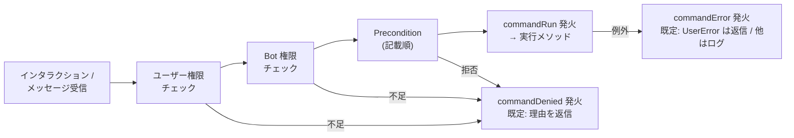

# コマンド

`Command` は最大4つのフローを持てます。必要なものだけ実装してください:

| メソッド | フロー |
| --- | --- |
| `chatInputRun(interaction)` | スラッシュコマンド(`/ping`) |
| `messageRun(message, args)` | プレフィックスコマンド(`!ping`)— `defaultPrefix` / `fetchPrefix` が必要 |
| `mentionRun(message, content)` | メンションコマンド(`@Bot こんにちは`)— 既定は Bot 自身へのメンションに反応 |
| `autocompleteRun(interaction)` | スラッシュオプションの autocomplete |

コマンド名はクラス名から導出されます(`PingCommand` → `ping`、
`UserInfoCommand` → `user-info` —
[プロジェクト構成](../getting-started/project-structure.md))。

## スラッシュコマンド

```ts title="src/commands/EchoCommand.ts"
import {
  ApplicationCommandOptionType,
  Command,
  type ChatInputCommandInteraction,
} from "@cc-discord-framework/core";

@Command.define({
  description: "入力した文字列をそのまま返します。",
  options: [
    {
      type: ApplicationCommandOptionType.String,
      name: "text",
      description: "何と言いますか?",
      required: true,
    },
  ],
})
export class EchoCommand extends Command {
  override async chatInputRun(interaction: ChatInputCommandInteraction) {
    await interaction.reply(interaction.options.getString("text", true));
  }
}
```

`options` は生の Discord API 形式(`APIApplicationCommandOption[]`、
discord-api-types による型付け)です — フレームワーク独自のオプション
DSL は存在しません。サブコマンド、choices、チャンネル種別など、API が
サポートするものはそのまま書けます。

スラッシュ対応コマンドは起動時に検証されます: 名前は Discord の規則を
満たす必要があり(導出名は常に適合)、1〜100文字の `description` が
必須です。

### 登録(同期)

ready 時にスラッシュ対応コマンドが一括登録されます:

- コマンドの `guildIds`、またはクライアントの `applicationGuildIds` が
  あればギルド登録 — 即時反映、開発向き
- なければグローバル登録(反映に最大1時間)

`syncApplicationCommands: false` で無効化し、
`client.stores.get("commands").syncApplicationCommands()` を自分で
呼ぶこともできます。同期が完了すると `commandsSynced` イベントが
発火します。

### 高度なペイロード

メタデータが扱わない API フィールド(contexts、integration types など)は
`toApplicationCommand()` のオーバーライドで追加します:

```ts
override toApplicationCommand() {
  return { ...super.toApplicationCommand(), integration_types: [1] };
}
```

## メッセージ(プレフィックス)コマンド

プレフィックスを設定し、`messageRun` を実装します:

```ts
const client = new Client({ intents: [...], defaultPrefix: "!" });
```

```ts
@Command.define({ aliases: ["status"] })
export class StatsCommand extends Command {
  override async messageRun(message: Message, args: string[]) {
    await message.reply(`args: ${args.join(", ")}`);
  }
}
```

- 検索は大文字小文字を区別せず、`aliases` も含みます。
- Bot と Webhook のメッセージは無視されます。
- 複数のプレフィックスが重なる場合は最長一致です(`"!"` と `"!!"`)。
- ギルド毎のプレフィックスは `fetchPrefix` で解決できます —
  `(message, container) => プレフィックス | プレフィックスの配列 | null` の形で、
  配列を返すと複数のプレフィックスを同時に受け付けます。`null` を
  返すとそのメッセージではメッセージコマンドが無効になります。
- 1つのクラスで `chatInputRun` と `messageRun` の両方を実装できます。

:::warning

メッセージ内容の取得は特権インテント(Message Content Intent)です。
可能ならスラッシュコマンドを優先してください。

:::

## メンションコマンド

`mentionRun` を実装するだけで、**Bot 自身へのメンションを含むメッセージ**
に反応します。プレフィックスの設定は要りません:

```ts
@Command.define()
export class AssistantCommand extends Command {
  override async mentionRun(message: Message, content: string) {
    // content は本文から対象のメンションを取り除いて trim した文字列
    await this.services.ai.reply(message, { prompt: content });
  }
}
```

反応する相手は `mentions` オプションで変えられます — Bot 自身に限らず、
**任意のユーザー(別の Bot)へのメンション**にも反応できます:

```ts
@Command.define({ mentions: ["123456789012345678"] })  // ユーザー ID
@Command.define({ mentions: ["self", "123456789012345678"] })  // 自分 + 指定ユーザー
@Command.define({ mentions: false })  // mentionRun があっても反応しない
```

- 対象へのメンションは本文の **どこにあっても** 反応します
  (`おい @Bot 教えて` でも可)。リプライのピンは本文に現れないので、
  返信しただけでは発火しません。
- Bot と Webhook のメッセージは無視されます。
- メンションコマンドが消費したメッセージは、プレフィックスコマンドの
  解析には回りません(メンションが最優先)。
- 複数のコマンドの対象にマッチした場合は、本文で先に現れた対象の
  コマンドが1つだけ実行されます。同じ対象を2つのコマンドが宣言すると
  起動時にエラーです。
- [Precondition](./preconditions.md) と権限ゲートはメッセージコマンドと
  同じように通ります(判定は `messageRun` フロー)。`commandRun` などの
  イベントには `type: "mention"` の payload が届きます。

:::warning

本文を読むため、こちらも Message Content Intent が必要です。

:::

## コマンドのガード

```ts
@Command.define({
  description: "サーバーのプレフィックスを変更します。",
  preconditions: ["OwnerOnly"],             // 自作の名前付きガード
  requiredUserPermissions: "ManageGuild",   // フレームワークが検査
  requiredClientPermissions: ["SendMessages"],
  defaultMemberPermissions: "ManageGuild",  // Discord 側の表示ゲート
})
```

- `requiredUserPermissions` / `requiredClientPermissions` はディスパッチ
  ゲートがギルド内で強制します(権限が存在しない DM では拒否)。
- `preconditions` は再利用可能な自作ガード —
  [Precondition](./preconditions.md)。
- `defaultMemberPermissions` は Discord 自身の UI レベルのゲートです。

拒否時にユーザーへ返る文言(ギルド外・権限不足)はフレームワークの既定
(日本語)がそのまま使われますが、クライアントの `texts` オプションで
項目ごとに差し替えられます —
[エラー処理](./error-handling.md)。

## 1回の実行の流れ



## コマンド内のエラー

ユーザーに見せたい失敗は `UserError` を throw してください。それ以外は
バグとして扱われます(構造化ログ + 汎用返信)。詳しくは
[エラー処理](./error-handling.md)を参照してください。
