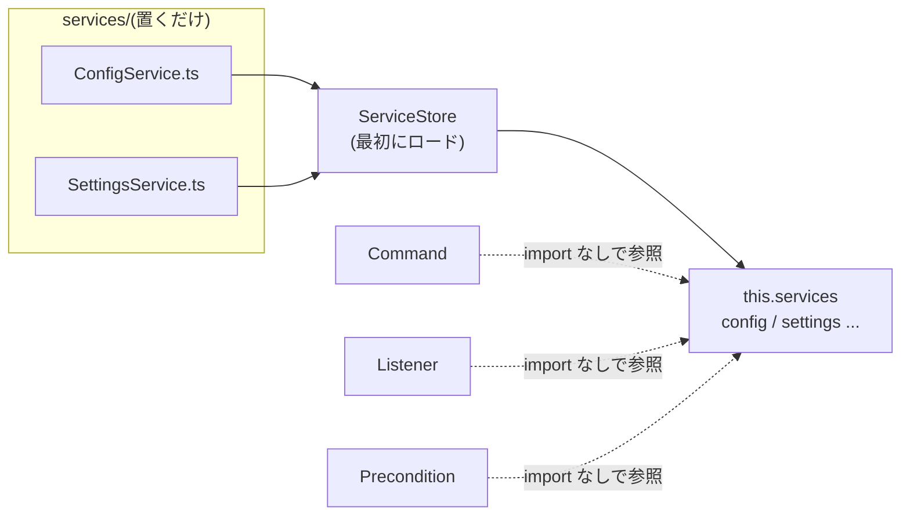

# サービス

**Service** はアプリケーション横断のロジック・状態(設定、データベース、
外部 API クライアントなど)を担うコンポーネントです。`services/` に
置くだけで自動ロードされ、**どのコンポーネントからも import なしで**
`this.services.<名前>` として参照できます — モジュール同士の結びつきが
1か所に収束します。



```ts title="src/services/ConfigService.ts"
import { createEnv, Service } from "@cc-discord-framework/core";

const env = createEnv(); // 環境変数の定番の読み方(詳細は「環境変数」)

@Service.define()
export class ConfigService extends Service {
  readonly ownerIds = env.list("OWNER_IDS");
  readonly defaultPrefix = env.text("DEFAULT_PREFIX") ?? "!";
}

declare module "@cc-discord-framework/core" {
  interface Services {
    config: ConfigService;
  }
}
```

```ts
// どこかのコマンド — ConfigService の import は不要
@Command.define({ description: "..." })
export class ExampleCommand extends Command {
  override async chatInputRun(interaction: ChatInputCommandInteraction) {
    const { ownerIds } = this.services.config;   // 完全に型付き
  }
}
```

## 名前

サービス名はプロパティとして自然に参照できるよう lowerCamelCase で
導出されます: `ConfigService` → `config`、`GuildSettingsService` →
`guildSettings`。`@Service.define({ name })` で明示もできます。

型を効かせる鍵は `Services` インターフェースの宣言マージです。サービスを
定義したファイルに必ず併記してください(上の例)。

## ライフサイクル

サービスにもコンポーネントのライフサイクルがそのまま適用されます。
接続を開くのは `onLoad`、閉じるのは `onUnload` です:

```ts title="src/services/SettingsService.ts"
// bun:sqlite の例
import { Database } from "bun:sqlite";
import { Service } from "@cc-discord-framework/core";

@Service.define()
export class SettingsService extends Service {
  #db!: Database;

  override onLoad() {
    this.#db = new Database(Bun.env.DATABASE_PATH ?? "bot.sqlite", { create: true });
  }

  override onUnload() {
    this.#db.close();   // client.destroy() で呼ばれる
  }
}
```

:::note

フレームワークのコアは Prisma / SQLite / Redis などの具体を一切
知りません。データベースはただのサービスです — `services/` に置いて
`onLoad` で接続し、`onUnload` で閉じてください。

:::

## ロード順

サービスストアは**最初に**ロードされるため、コマンドやリスナーの
`onLoad` からもサービスを利用できます。`fetchPrefix` などのクライアント
オプション内でも、実行は必ずロード後なので安全に参照できます:

```ts
fetchPrefix: (message, container) =>
  container.services.settings.getPrefix(message.guildId) ?? "!",
```

## サービス同士の参照

サービスから別のサービスも `this.services.<名前>` で参照できます。
ただし `onLoad` 内で他サービスに依存する場合はロード順(ファイル名の
辞書順)に注意し、依存が複雑になるなら参照を実行時(メソッド内)まで
遅延させてください。

## コンテナとの使い分け

`this.services` は「`services/` に置いた自分のクラス」の置き場、
[コンテナ](../advanced/container-and-services.md)直下
(`container.client` など)はフレームワーク組み込みのサービスです。
プラグインが提供する値はどちらの形もあり得ます(プラグインの
ドキュメントに従ってください)。
